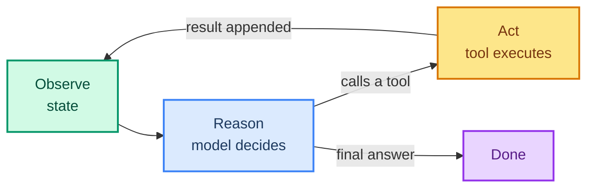

# 01: What Is the Loop? The Observe → Act Anatomy

> **Part of the [Loop Engineering](./00-readme.md) notes.** After this note you will be able to *name* the parts of an agent loop and read any framework's trace as a loop.

---

## The Minimal Loop

Every agent, whatever the framework, implements this cycle:

1. **Observe** — read the current state (messages, tool results, context).
2. **Reason** — ask the model to produce the next step (a turn, a tool call, or a final answer).
3. **Act** — if the model chose a tool, run it and append its result to the state.
4. **Repeat** until the model produces a final answer **or** a bound is hit.

```python
# pseudocode — what create_agent / LangGraph actually walks
def agent_loop(initial_state, model, tools, stop_check):
    state = initial_state
    for step in range(MAX_STEPS):
        out = model.invoke(state)          # REASON
        if out.is_final():                 # REASON decided: done
            return finalize(out, state)
        if stop_check(state, step):        # BOUND: safety/ budget
            raise OrContinue else break
        result = tools[out.tool].invoke(out.args)   # ACT
        state += (out, result)             # OBSERVE: append to history
    raise TimeoutOrStepLimit
```

That's it. Everything fancy — memory, middleware, subagents — plugs into one of these four boxes.



## State Is the Memory of the Loop

The loop only works if each step can *see* what happened before. That shared record is the **agent state**. It typically holds:

- **messages** — every user turn, model turn, and tool result.
- **tool results** — machine-readable outputs the model references.
- **custom fields** — e.g., a `todo` list, a `success` flag, accumulated data.

In LangGraph the state is reduced after every node. Each step is deterministic *given* the state — that's what lets you pause, resume, and replay (see [05](./05-loop-observability.md)).

## Spotting the Loop in a Real Trace

Open any LangSmith trace (ch 28). You'll see the same shape repeated:

```
AgentNode
├── ChatGroq            ← REASON
├── ToolNode
│   └── calculate       ← ACT
└── Chat or ToolNode    ← observe + reason again
```

Count the recursion depth: that's your loop length. A healthy RAG agent (ch 21) is usually **2-3 turns**. A complex research/multi-step task (projects 4, 5) may be **10-30 turns**.

## When a Handful of Turns Becomes Thousands

An un-bounded loop is the #1 production failure. It wastes tokens, blocks the thread, and can call side-effecting tools repeatedly. That's exactly what [02 - Loop Termination](./02-loop-termination.md) and [04 - Loop Boundaries](./04-loop-boundaries.md) prevent.

---

## What You Learned

- The loop = observe → reason → act, repeated until `done`.
- State is the loop's memory; every step reads and appends to it.
- What code maps to each box (and where tools/model/invoke sit).
- Why un-bounded loops are the core risk.

**Next:** [02 - Loop Termination](./02-loop-termination.md) — the stopping conditions that keep the loop finite.