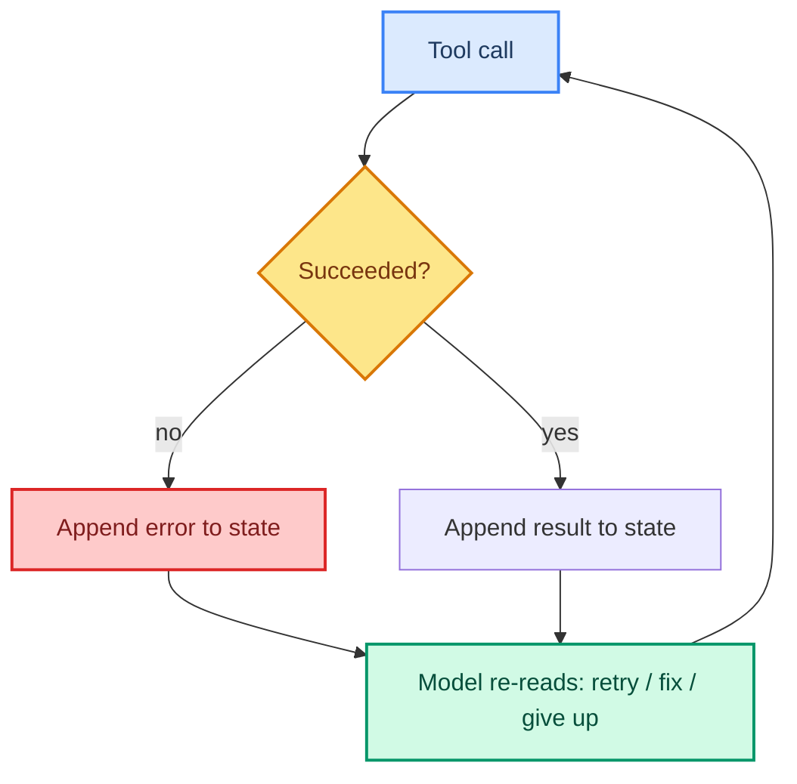

# 03: Error Recovery — Helping the Loop Survive a Bad Turn

> **Part of the [Loop Engineering](./00-readme.md) notes.** Errors are a *normal* part of a loop, not an exception. This note is about recovering from them **inside** the loop instead of crashing out.

---

## Failure Is an Input, Not a Dead End

When a tool fails, the loop does **not** end — the failure becomes part of the state, and the model gets another chance to reason with that new information. That turning of an error into an *observable event* is what makes agents resilient.



The rule: **never swallow an error silently**. Always put it in the state so the model (and a human auditor) can see it.

---

## Recovery Strategy 1: Automatic Retry (Transient Errors)

Retry when the failure is likely temporary and idempotent-safe to repeat: network blips, rate limits, 429/5xx, timeouts. LangChain's `ToolRetryMiddleware` (ch 15) wraps this for you.

```python
from langchain.agents.middleware import ToolRetryMiddleware

agent = create_agent(
    model=llm,
    tools=[search, fetch],
    middleware=[ToolRetryMiddleware(max_retries=3, backoff_factor=2)],
)
```

**Do NOT** auto-retry non-idempotent or expensive actions (billing, PLC setpoints, deletes). Those need HITL, not retry.

---

## Recovery Strategy 2: Self-Correction (Semantic)

When a tool *ran* but the result is wrong (empty search, schema mismatch, validation failure), the model should **look at the error text and try a corrected call**. Keep error messages informative so recovery actually works:

```python
@tool
def write_setpoint(device_id: str, value: float) -> str:
    if not 0 <= value <= 5000:
        return f"REFUSED: {value} out of allowed range [0, 5000]"
    ...
```

Notice the message tells the model the *valid* range — that's a self-correctable error, not a dead end.

---

## Recovery Strategy 3: Structured Fallbacks

A chain/tool can have explicit fallbacks (ch 40 covers provider fallback at the serving layer; here it's inside the loop):

```python
def retrieve_with_fallback(query):
    for store in (vector_db, keyword_index, hardcoded_facts):
        try:
            hits = store.search(query)
            if hits: return hits
        except Exception:
            continue
    return []   # honest: nothing found
```

---

## Recovery Strategy 4: Give Up Gracefully

Not every task is solvable. A bounded loop must be allowed to declare "I could not complete this." Use a **failure budget** inside the loop so it can't spin forever retrying a dead end:

```python
MAX_FAILURES = 3
def should_continue(state):
    if state.get("failures", 0) >= MAX_FAILURES:
        return "give_up"          # node writes an honest partial answer
    return "loop"
```

Track `failures` every time a tool returns an error; reset it when a call succeeds.

---

## Where to Put Recovery Logic

| Concern | Tool |
|--------|------|
| Auto-retry transient tool failures | `ToolRetryMiddleware` |
| Retry model calls | `ModelRetryMiddleware` |
| Structure / validation errors | Tool node code + self-corrective prompt |
| Fallback chains | Tool implementation or serving layer (ch 40) |
| Whole-run failure budget | Loop / graph state + conditional edge |

---

## Common Mistakes

- Swallowing errors (logging only) so the model can't see or react.
- Auto-retrying **side-effecting** tools that are not idempotent.
- Infinite rebound between two failing strategies — no failure budget.
- Error messages that don't tell the model *what to do next*.

---

## What You Learned

- Errors become state, not terminations.
- Four recovery strategies: retry, self-correct, fallback, graceful stop.
- The failure-budget gate that prevents a retry-forever loop.
- The difference between retryable (transient) and non-retryable (side-effect).

**Next:** [04 - Loop Boundaries](./04-loop-boundaries.md) — the hard limits that keep any run finite and affordable.