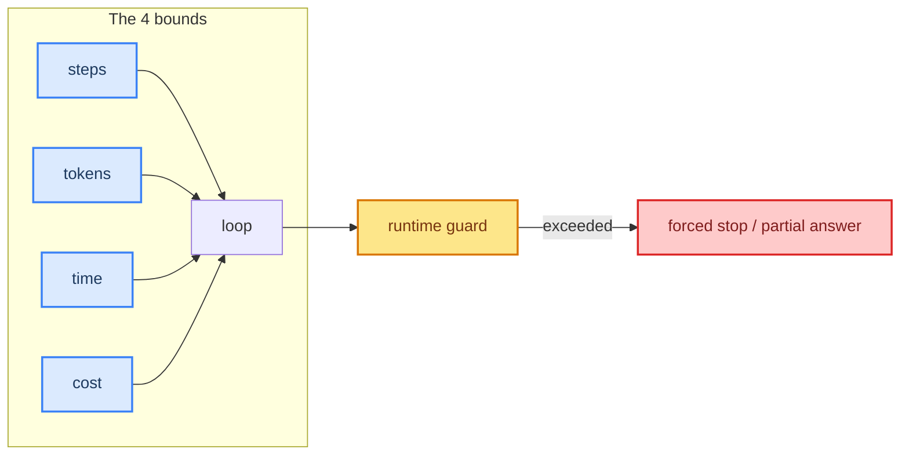

# 04: Loop Boundaries — Tokens, Time, Steps, and Cost

> **Part of the [Loop Engineering](./00-readme.md) notes.** A runnable loop is cheap. A bounded loop is safe. This note is about drawing the hard edges around any agent run.

---

## Why Boundaries Matter

Every loop iteration costs money, tokens, and wall-clock time. Without boundaries an agent can:

- Burn a month of token budget on one runaway conversation.
- Call a billing/PLC tool in a loop because the model is stuck.
- Hang a thread forever, blocking other work (and other users).

Boundaries are the **engineering contract**: the run *will* end, no matter what the model does.

---

## The Four Boundaries



| Bound | Typical default | Why |
|-------|-----------------|-----|
| **Steps** | 10-30 | Hard stop on tool rounds |
| **Tokens** | 50k-200k/run | Real cost control |
| **Wall-clock** | 60-300s | Threads, SLAs, UX |
| **Cost** | $0.10-$5/run | Business guard |

---

## Measuring Cumulative Usage

Tokens must be **accumulated across the whole run**, not per call. LangChain tracks usage on each model call; sum it in middleware:

```python
from langchain_core.middleware import MessageAfterModel

class UsageBudget(BaseMiddleware):
    def __init__(self, max_tokens: int, max_seconds: int):
        self.max_tokens = max_tokens
        self.deadline = time.monotonic() + max_seconds
        self.used = 0

    async def after_model(self, model: MessageAfterModel):
        usage = getattr(model.result, "usage_metadata", None) or {}
        self.used += usage.get("total_tokens", 0)

    def over_budget(self, step: int) -> bool:
        return (step >= self.max_steps or self.used >= self.max_tokens
                or time.monotonic() > self.deadline)
```

Then check `over_budget()` at the top of the loop node and route to a `forced_stop` node.

---

## Enforcing in LangGraph

Boundaries are easiest to enforce with state + a conditional edge (see also [02](./02-loop-termination.md)):

```python
budget = UsageBudget(max_tokens=80_000, max_seconds=180)  # module-level

def agent_node(state):
    if budget.over_budget(state["step"]):
        return {"over": True, "messages": state["messages"]}
    result = model.invoke(state["messages"])
    return {"messages": [result], "step": state["step"] + 1}

builder.add_conditional_edges(
    "agent",
    lambda s: "forced_stop" if s.get("over") else "tools",
    {"forced_stop": "forced_stop_node", "tools": "tools"},
)
```

---

## Cost Awareness (Free-Tier Reality)

With Groq's free tier (the model family in this course), **token budget is your main free-tier throttle**. Good practices for this course's projects:

- Keep tool results **truncated** (ch 19 structured output, ch 30 performance) so history doesn't blow up.
- Use `summarization`/compaction (ch 10) when loops get long.
- Set an explicit per-run token cap so an experiment can't exhaust the free quota.

```python
llm = ChatGroq(model="openai/gpt-oss-120b", temperature=0,
               max_tokens=2048)          # per response
```

---

## Graceful vs Abrupt Stop

Abrupt stop = hard kill, user sees nothing. Graceful stop = the loop writes its best partial answer and explains why it stopped (see the `force_stop_node` in [02](./02-loop-termination.md)). Always choose graceful: the *user* should decide whether to continue.

---

## Common Mistakes

- Boundary on steps only — tokens blow past it via long tool results.
- No wall-clock guard — a hung tool call holds the thread.
- Forgetting that **free tiers still cost budget** — set token caps.
- Treating a forced stop as a bug instead of a designed feature.

---

## What You Learned

- The four bounds: steps, tokens, time, cost.
- Accumulating usage in middleware and checking it in the loop node.
- Enforcing bounds with LangGraph conditional edges.
- Graceful partial answers instead of hard kills.

**Next:** [05 - Loop Observability](./05-loop-observability.md) — watching the loop while it runs.