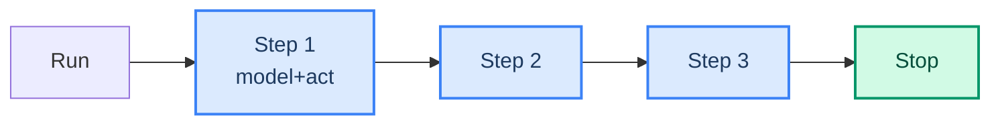

# 05: Loop Observability — Watching the Loop While It Runs

> **Part of the [Loop Engineering](./00-readme.md) notes.** You cannot engineer a loop you cannot see. This note ties the loop to tracing (LangSmith, ch 28) and checkpointing.

---

## What "Seeing the Loop" Means

A loop runs step by step: model decides → tool runs → result feeds back → model decides again. To tune and debug it, you need a **per-step record**: which model call, which tool, what it returned, and how many tokens/sec each useful in.



Two complementary tools deliver this:

- **LangSmith tracing** gives the live, nested view of every step.
- **A checkpointer** gives resumable state so you can replay or resume the loop.

---

## Tracing: Loop Metrics That Matter

Read the trace LangSmith produces (ch 28). The loop-specific metrics:

| Metric | Meaning |
|--------|---------|
| Steps taken | Does it stop when it should? |
| Tool calls per step | Actually working, or stuck? |
| Time / tokens per step | Where does the budget go? |
| Failure events | Which tool keeps failing? |
| HITL decision | Was the human gate honored? |

A healthy loop reads like a story: act → act → reason → done. A **spin** reads the same few lines: the same tool called with the same error, repeatedly. Spins are the clearest signal to add recovery (ch 03) or a boundary (ch 04).

---

## Checkpointing: Make the Loop Resumable

LangGraph checkpoints store state after every node/step. That gives a loop three superpowers:

- **Resume** after a HITL pause or a crash (ch 18).
- **Replay** from any past step — much easier debugging.
- **Branch** from a past step — try a different tool without rerunning.

```python
from langgraph.checkpoint.memory import InMemorySaver
from langgraph.graph import StateGraph

checkpointer = InMemorySaver()      # swap for Postgres in prod

graph = builder.compile(checkpointer=checkpointer)
# resume a paused thread exactly where it stopped
config = {"configurable": {"thread_id": "proj5-thread-42"}}
graph.invoke({"msg": "Approved"}, config=config)
```

---

## Log the Cycle, Not Just the Hooks

Middleware hook logging (ch 35) records each event; the **loop** also needs a per-cycle record: the step number, decision, token spend, and stop reason. Add an audit line per step:

```python
import time

def log_step(step, tool, ok, tokens):
    emit_audit({
        "action": "loop_step",
        "step": step,
        "tool": tool,
        "ok": ok,
        "tokens": tokens,
        "ts": int(time.time()),
    })
```

Then a question like "did the agent call the setpoint tool in a loop?" becomes a query, not a guess (see the PLC project's audit trail).

---

## Common Mistakes

- Inspecting only the final answer, missing the loop's intermediate steps.
- No checkpointer configured — a stuck loop can't be replayed or resumed.
- Logging tool hooks but not the **cycle** (step, cost, stop reason).
- Ignoring a spin: a trace that repeats the same failing call.

---

## What You Learned

- Per-step observability = traces + checkpoints.
- Loop metrics: steps, tool calls, tokens, failures, HITL.
- Replay / resume via the checkpointer.
- Appending a per-cycle record to your audit log (ch 35).

**Next:** [06 - Loop vs Graph](./06-loop-vs-graph.md) — a free-form loop vs a LangGraph state machine.