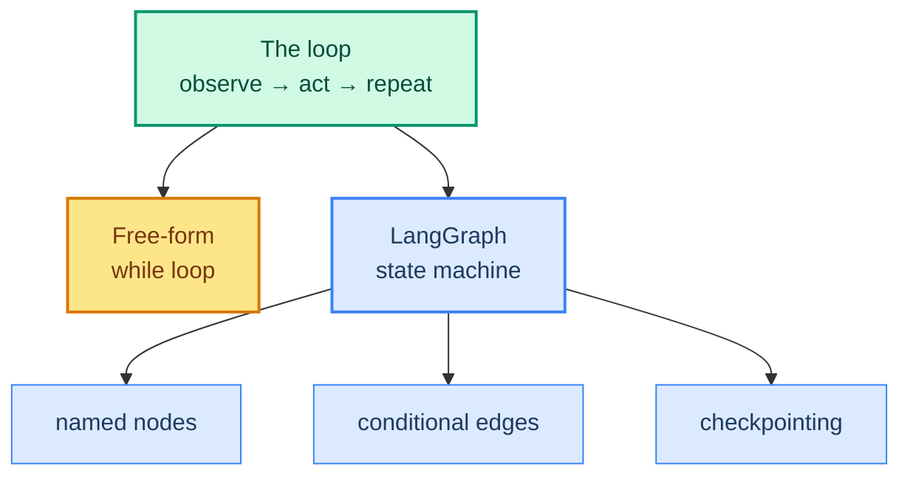
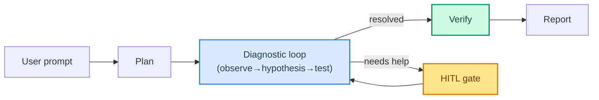

# 06: Loop vs Graph — Free-Form Loop or LangGraph State Machine

> **Part of the [Loop Engineering](./00-readme.md) notes.** "Loop" is the *idea*; LangGraph is one *implementation*. This note says when to let the loop be implicit, and when to make it an explicit graph.

---

## The Same Idea, Two Shapes

The loop from note 01 can be built in two ways:

1. **Free-form loop** — your own `while`/`for` that calls the model and tools directly. Simple, flexible, few moving parts.
2. **State graph** (LangGraph) — the loop is a *state machine* with named nodes, edges, and checkpoints. More structured, resumable, inspectable.

Both run observe → act → repeat. The difference is **control and observability**, not capability.



---

## The Free-Form Loop

Good for: one-off scripts, demos, simple single-tool agents, learning. The whole loop is explicit:

```python
state = [HumanMessage(user_input)]
for _ in range(MAX_STEPS):
    reply = llm.invoke(state)
    if not reply.tool_calls:           # final answer
        return reply
    for tc in reply.tool_calls:
        result = tool_map[tc["name"]].invoke(tc["args"])
        state.append(tc)               # assistant turn
        state.append(ToolMessage(result))
```

**Pros:** no concepts to learn, fully under your control. **Cons:** no built-in checkpointing, replay, or routing; recovery is all yours to write.

---

## The LangGraph State Machine

For: production, HITL, multiple workflows, recovery logic — anything where you want the loop *visible* and *resumable*.

```python
from langgraph.graph import StateGraph, END
from langgraph.prebuilt import ToolNode

builder = StateGraph(AgentState)

builder.add_node("model", model_node)
builder.add_node("tools", ToolNode(tools))

builder.add_edge(START, "model")
builder.add_conditional_edges(
    "model",
    lambda s: "tools" if s["messages"][-1].tool_calls else END,
    {"tools": "tools", END: END},
)   # this conditional edge IS the loop
builder.add_edge("tools", "model")

graph = builder.compile(checkpointer=InMemorySaver())
```

Here the loop is a **cycle in the graph**: model → tools → model... The conditional edge decides when to exit. You can add nodes (HITL, summaries, validation) anywhere in that cycle.

---

## Choosing Between Them

| Concern | Use free-form | Use a graph |
|---------|---------------|-------------|
| Simple single-tool script | ✓ | |
| Parallel tools / subagents (ch 26) | | ✓ |
| HITL pause/resume (ch 18) | | ✓ |
| Checkpointing / replay | | ✓ |
| A fixed *list* of steps (not a loop) | | ✓ |
| Full transparency of a tiny loop | ✓ | |

Rule of thumb: **as soon as you want to pause, resume, replay, or route — reach for the graph.** As long as you want a quick experiment, the free loop is simpler.

---

## Hybrid: A Graph Containing a Loop

Most real agents are a **graph at the top** (routing, HITL, boundaries) wrapping a **loop inside** (many turns for one task). For example the PLC agent in project 5: an outer graph decides analyze / fix / confirm, and each analysis step loops over observed symptoms.



---

## Common Mistakes

- Building a graph for a 2-line math tool (over-engineering).
- Using a free loop for a stateful, resumable production flow (under-engineering).
- **Loops in a graph with no conditional edge to exit** → an infinite loop you can't break.
- Recreating checkpointing by hand when the graph gives it to you.

---

## What You Learned

- The loop is an idea; free-form and graph are two builds.
- Free-form = simple, explicit; Graph = resumable, inspectable, routable.
- The conditional edge is literally the loop in LangGraph.
- A graph can *contain* an inner loop (plan → loop → verify).

**Next:** [07 - Loop Security](./07-loop-security.md) — injection and side-effect risks unique to repetitive Rounds.