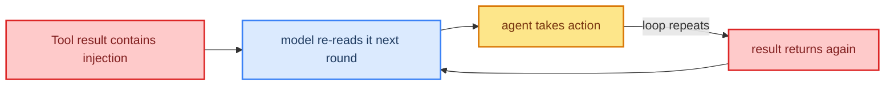

# 07: Loop Security — Injection and Side-Effects in Repetitive Rounds

> **Part of the [Loop Engineering](./00-readme.md) notes.** A loop amplifies risk: one injected instruction or one runaway tool call *repeats* every round. This note layers security on top of ch 31–35 and applies it specifically to the loop.

---

## How the Loop Multiplies Risk

In a loop the model reads **tool results** and **prior turns** over and over. That means:

- A **prompt injection** hiding inside one tool result gets *re-read* next round (ch 32) — and if the agent keeps calling that tool, the poison is reinforced each time.
- A **side-effecting tool** called repeatedly has repeated effects (billing, deletes, setpoints). Loop + non-idempotent action = the worst combination.
- **Context grows** every round, so more text (including adversarial text) reaches the model.



---

## Defense 1: Treat Every Tool Result as Untrusted Content

Apply the core rule from ch 32 in the loop: **tool output is data, not instructions.** Assert that boundary in the system prompt, and rely on middleware to sanitize/label results so the model doesn't "obey" injected text.

```python
# loop guard: strip any embedded instruction-as-text from tool output
def mark_content_only(result: str):
    return "[content-only block]\n" + result[:2000]   # no commands allowed
```

---

## Defense 2: Deploy every round

Because the same tool may run each round, per-round validation is not enough. Make the *cycle* enforce policy:

- **Idempotency / limit of side-effecting tools** — a delete or setpoint tool may fire at most once, or require HITL (ch 18) no matter how many times the model asks.
- **Rate-limit the tool call** — block a tool that exceeds a per-run call limit (fold it into the [04](./04-loop-boundaries.md) budget).
- **Reassess per round** — revisit the permission for each action, weighing the risk of destructive tools each time.

```python
def guard_tool(state, tool_name):
    calls = state["tool_counts"].get(tool_name, 0)
    if tool_name in state["side_effecting"] and calls >= 1:
        return "need_hitl"       # never auto-run a 2nd destructive call
    return "ok"
```

---

## Defense 3: Bounded = Safe

The single best mitigation against a *repeating* injection is the **boundary** from [04](./04-loop-boundaries.md). A loop that stops after N steps / tokens cannot pack forever-piling poison. Layering order:

1. **Bound** the loop (steps/time/tokens).
2. **Treat content as data** every round.
3. **Guard** side-effecting tools + HITL.
4. **Audit** every round (ch 35) for post-hoc evidence.

---

## Defense 4: Watch for the Spin

Security and reliability meet at the **detection of a spin** (a tool called with the same args in a loop). Combine loop metrics ([05](./05-loop-observability.md)) with alerting:

```python
from collections import Counter
def detect_spin(step_log, max_same=2):
    recent = Counter((e["tool"], tuple(e["args"])) for e in step_log[-4:])
    bad = [k for k, v in recent.items() if v > max_same]
    if bad:
        emit_alert("loop_spin", bad)
        return True
    return False
```

A spin is both a bug and a possible attack — stop the loop and route to HITL.

---

## The Loop Security Checklist

| # | Guard | Layer |
|---|-------|-------|
| 1 | Bound steps/tokens/time | Boundary |
| 2 | Treat tool results as data | Input |
| 3 | Idempotency / HITL for side effects | Action |
| 4 | Per-round rate limits | Action |
| 5 | Spin detection + alert | Observability |
| 6 | Audit every round | Evidence |

---

## Common Mistakes

- Auto-retrying a side-effecting tool across rounds (a repeated blast of effects).
- Only sanitizing the *first* tool result, not every round.
- No call-limit per tool, so an injected repeat loops forever.
- No detection of a spin — tokens burn while advancing the same bad call.

---

## What You Learned

- The loop *re-reads* tool results → injections resurface each round.
- Treat content as data every round; guard side-effecting ops; HITL for destructive.
- Bounds ([04](./04-loop-boundaries.md)) are the key defense for repetitive risk.
- Detecting and alerting a **spin** as a security signal.

That's loop engineering — you now have the observe-act loop, its stopping conditions, its recovery, its boundaries, its observability, the choice of graph vs free-form, and its security. **Back to the [folder root](./00-readme.md).**