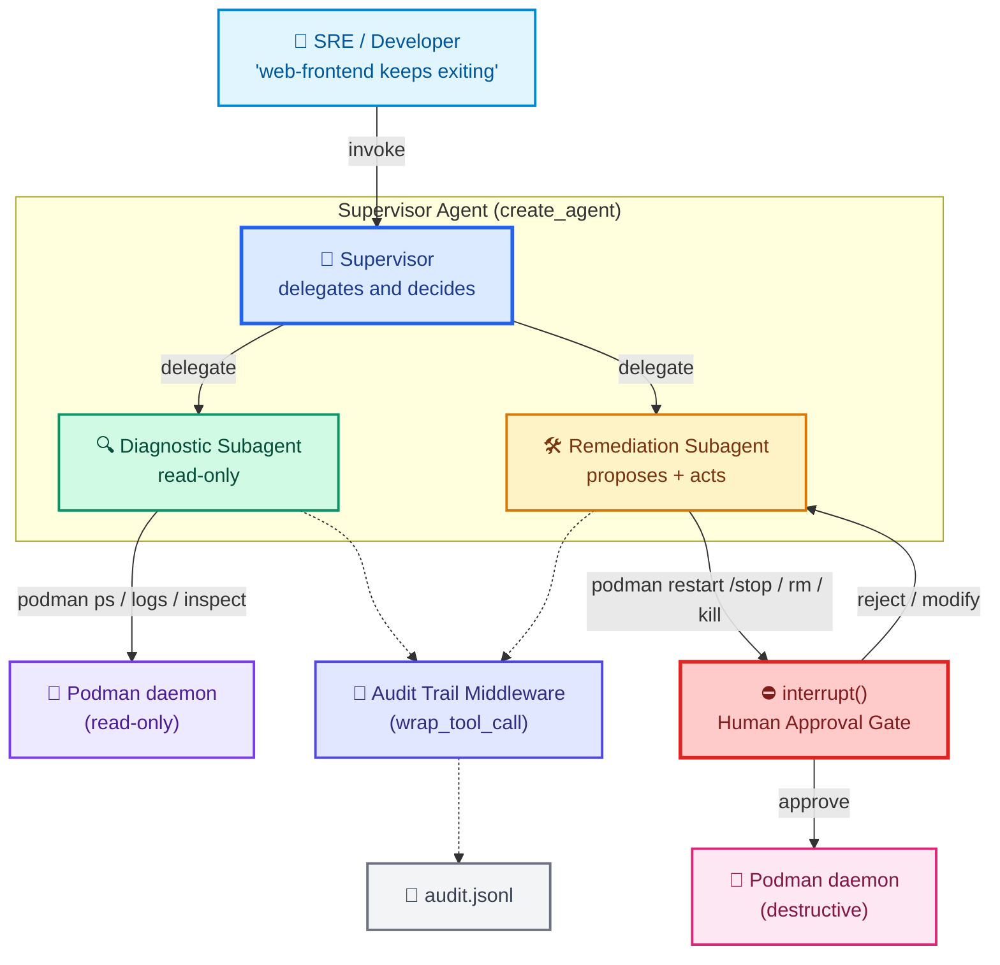

# Project 1: Podman Container Troubleshooting Agent (Multi-Agent with Human Approval)

> **Goal:** Build a multi-agent system that diagnoses Podman container problems and proposes fixes — with a Human-in-the-Loop gate before any destructive action.
> **Previous:** [46 - CI/CD for AI Agents](./46-cicd-for-ai-agents.md)
> **Next:** [Project 2 - Agentic ETL Pipeline Orchestrator](./project-2-etl-pipeline-agent.md)

---

## Why This Project Matters

You have just spent 44 lessons learning the building blocks of LangChain agents: tools, middleware, memory, subagents, MCP, security, and human-in-the-loop. A real engineering portfolio needs **one project that ties them together** in a way that looks like on-the-job SRE work — not a toy.

Containers fail at 2 AM. Logs scroll forever. Engineers on-call want a tool that:

1. Reads `podman ps -a`, finds the broken container, and summarizes the failure.
2. Pulls `podman logs`, `podman inspect`, and image metadata to form a hypothesis.
3. Suggests a fix — and, if the fix is **destructive** (stop, rm, kill), refuses to run until a human clicks **Approve**.
4. Logs **every** action it considered, every tool it called, and every human decision into an audit trail.

This is exactly what an SRE agent should look like. It is also exactly the kind of project that fits a 4-year engineer's GitHub — small, well-written, and demonstrates *real* production patterns:

- **Subagent isolation** (one brain for diagnosis, a different brain for remediation).
- **HITL gate** with `interrupt()` so the agent cannot delete your database container on its own.
- **Audit middleware** so every action is reviewable in a future incident.
- **Optional MCP server** so the same Podman tools can be reused by other agents in the org.

We will use **only free tools** (Podman itself, Python stdlib, LangChain/LangGraph, Groq `openai/gpt-oss-120b`). No paid services.

---

## Architecture Overview



The flow has three layers:

1. **Supervisor (top).** Decides which subagent to call. The human talks only to the supervisor.
2. **Diagnostic subagent (left, read-only).** Free to run any read command — `ps`, `logs`, `inspect`. No approval needed because nothing changes.
3. **Remediation subagent (right, destructive).** Proposes fixes. **Before** it executes a destructive command, it calls `interrupt()`. The human is shown what the agent wants to do and either approves, rejects, or edits it.

A `wrap_tool_call` audit middleware sits beside both subagents and records every tool call to `audit.jsonl`.

---

## The Security Model

| Action category | Examples | Approval required? |
|---|---|---|
| **Read** | `podman ps`, `podman logs`, `podman inspect`, `podman images` | ❌ No — safe |
| **Safe remediation** | `podman restart`, `podman start`, `podman unpause` | ✅ Yes — changes state |
| **Destructive** | `podman stop`, `podman rm`, `podman kill`, `podman rmi` | ✅ Yes — irreversible |

The rule is enforced two ways:

1. **Tool design.** Read tools never call `interrupt()`. Destructive tools **always** call `interrupt()` first.
2. **Supervisor prompt.** The supervisor is told which actions are destructive so it can choose read-only diagnosis first.

This is the same "least privilege" pattern you would use for a database agent, a cloud agent, or a filesystem agent — read for free, write only with approval.

---

## Project Layout

```
project-1-podman-troubleshooting-agent/
├── podman_tools.py          # @tool wrappers around podman CLI
├── audit_middleware.py       # wrap_tool_call audit logger
├── mcp_server.py             # OPTIONAL: FastMCP server (same tools over MCP)
├── agent.py                  # Main supervisor + subagents (run this!)
├── audit.jsonl               # Generated at runtime
└── README.md
```

You can build it without the MCP file first (use `podman_tools.py` directly). The MCP version is a "level up" — it shows the same agent connecting to its tools over the MCP protocol so other agents in your org can reuse them.

---

## Step 1 — The Podman Tools

Save as `podman_tools.py`. These are plain `@tool` functions that shell out to `podman`.

The two design choices to notice:

- **Read tools** take no `runtime`, return strings, and never pause the agent.
- **Destructive tools** take `runtime` (to read `tool_call_id`), call `interrupt()`, and either run the command or report that the human cancelled.

```python
# podman_tools.py
"""Tools for talking to Podman. Read-only tools are safe; destructive
tools call interrupt() so a human must approve before they execute."""
from __future__ import annotations

import json
import subprocess

from langchain.tools import tool, ToolRuntime
from langchain.messages import ToolMessage
from langgraph.types import interrupt, Command


# --------------------------------------------------------------------------
# Helpers
# --------------------------------------------------------------------------
def _run(cmd: list[str], timeout: int = 15) -> str:
    """Run a command, return combined stdout+stderr as a string."""
    try:
        result = subprocess.run(
            cmd,
            capture_output=True,
            text=True,
            timeout=timeout,
            check=False,
        )
        output = (result.stdout or "") + (result.stderr or "")
        return output.strip() or "(no output)"
    except FileNotFoundError:
        return f"ERROR: '{cmd[0]}' not found. Is Podman installed?"
    except subprocess.TimeoutExpired:
        return f"ERROR: command timed out after {timeout}s: {' '.join(cmd)}"


# --------------------------------------------------------------------------
# READ-ONLY tools (no approval needed)
# --------------------------------------------------------------------------
@tool
def podman_ps(all_containers: bool = False) -> str:
    """List Podman containers.

    Args:
        all_containers: If True, list stopped containers too (podman ps -a).
    """
    cmd = ["podman", "ps", "-a", "--format", "json"] if all_containers \
          else ["podman", "ps", "--format", "json"]
    out = _run(cmd)
    try:
        # Pretty-print so the model can parse it easily
        containers = json.loads(out)
        if not isinstance(containers, list):
            return out
        summary = []
        for c in containers:
            summary.append(
                f"- {c.get('Names')} [{c.get('State')}/{c.get('Status')}] "
                f"image={c.get('Image')} id={c.get('Id', '')[:12]}"
            )
        return "\n".join(summary) if summary else "No containers running."
    except json.JSONDecodeError:
        return out


@tool
def podman_logs(container: str, tail: int = 200) -> str:
    """Get the last N log lines from a container.

    Args:
        container: Container name or ID.
        tail: Number of trailing lines to fetch (default 200).
    """
    return _run(["podman", "logs", "--tail", str(tail), container])


@tool
def podman_inspect(container: str) -> str:
    """Inspect a container and return its config (image, mounts, env, exit code)."""
    out = _run(["podman", "inspect", container])
    try:
        data = json.loads(out)
        if isinstance(data, list) and data:
            c = data[0]
            state = c.get("State", {})
            config = c.get("Config", {})
            return (
                f"Name: {c.get('Name')}\n"
                f"Image: {config.get('Image')}\n"
                f"Status: {state.get('Status')} | ExitCode: {state.get('ExitCode')} | "
                f"OOMKilled: {state.get('OOMKilled')} | Error: {state.get('Error')}\n"
                f"Cmd: {config.get('Cmd')}\n"
                f"Entrypoint: {config.get('Entrypoint')}\n"
                f"Env: {config.get('Env')}\n"
                f"Mounts: {[m.get('Source') + '->' + m.get('Destination') for m in c.get('Mounts', [])]}"
            )
    except json.JSONDecodeError:
        return out
    return out


@tool
def podman_images() -> str:
    """List local Podman images."""
    return _run(["podman", "images", "--format",
                 "{{.Repository}}:{{.Tag}} {{.Size}} {{.ID}}"])


@tool
def podman_healthcheck(container: str) -> str:
    """Run the container's built-in healthcheck (if any) and return the result."""
    return _run(["podman", "healthcheck", "run", container])


# --------------------------------------------------------------------------
# DESTRUCTIVE tools (always interrupt() for approval)
# --------------------------------------------------------------------------
def _destructive(
    tool_call_id: str,
    verb: str,
    cmd: list[str],
    human_message: dict,
) -> Command:
    """Shared gate: interrupt -> if approved run cmd, else cancel."""
    approval = interrupt(human_message)

    if approval == "approve":
        result = _run(cmd)
        return Command(update={
            "messages": [ToolMessage(
                content=f"[{verb}] approved and executed.\n{result}",
                tool_call_id=tool_call_id,
            )]
        })

    return Command(update={
        "messages": [ToolMessage(
            content=f"[{verb}] CANCELLED by human reviewer. No changes made.",
            tool_call_id=tool_call_id,
        )]
    })


@tool
def podman_restart(container: str, runtime: ToolRuntime) -> Command:
    """Restart a container. Changes state — requires human approval.

    Args:
        container: Container name or ID to restart.
    """
    return _destructive(
        runtime.tool_call_id,
        "restart",
        ["podman", "restart", container],
        {
            "action": "podman_restart",
            "container": container,
            "warning": f"This will restart '{container}'. In-flight connections will drop.",
            "options": ["approve", "reject"],
        },
    )


@tool
def podman_stop(container: str, runtime: ToolRuntime) -> Command:
    """Stop a running container. Destructive — requires human approval.

    Args:
        container: Container name or ID to stop.
    """
    return _destructive(
        runtime.tool_call_id,
        "stop",
        ["podman", "stop", "-t", "10", container],
        {
            "action": "podman_stop",
            "container": container,
            "warning": f"This will send SIGTERM (10s grace) then SIGKILL to '{container}'.",
            "options": ["approve", "reject"],
        },
    )


@tool
def podman_rm(container: str, force: bool, runtime: ToolRuntime) -> Command:
    """Remove a container. Destructive and irreversible.

    Args:
        container: Container name or ID to remove.
        force: If True, force-remove even if running.
    """
    cmd = ["podman", "rm", "-f" if force else "", container]
    cmd = [c for c in cmd if c]
    return _destructive(
        runtime.tool_call_id,
        "rm",
        cmd,
        {
            "action": "podman_rm",
            "container": container,
            "force": force,
            "warning": (
                f"This will PERMANENTLY REMOVE container '{container}'."
                + (" Force mode will kill it first." if force else "")
                + " This cannot be undone."
            ),
            "options": ["approve", "reject"],
        },
    )


@tool
def podman_kill(container: str, signal: str, runtime: ToolRuntime) -> Command:
    """Send a signal to a container (default SIGKILL). Destructive.

    Args:
        container: Container name or ID.
        signal: Signal name or number (default KILL).
    """
    return _destructive(
        runtime.tool_call_id,
        "kill",
        ["podman", "kill", "--signal", signal or "KILL", container],
        {
            "action": "podman_kill",
            "container": container,
            "signal": signal or "KILL",
            "warning": f"This will send {signal or 'KILL'} to '{container}'.",
            "options": ["approve", "reject"],
        },
    )
```

Key things to notice:

- `podman_ps`, `podman_logs`, `podman_inspect`, `podman_images`, `podman_healthcheck` — **no `runtime`** parameter, **no `Command`** return, **no `interrupt()`**. The model can call them freely.
- `podman_restart`, `podman_stop`, `podman_rm`, `podman_kill` — they all funnel through `_destructive()`, which always calls `interrupt()`.
- `force` flags on `podman_rm` and the signal name on `podman_kill` are surfaced in the interrupt payload so the human sees exactly what is about to happen.

---

## Step 2 — Audit Trail Middleware

Save as `audit_middleware.py`. It is one `@wrap_tool_call` decorator that appends a JSON line per tool call to `audit.jsonl`.

```python
# audit_middleware.py
"""Records every tool call to audit.jsonl for incident review."""
from __future__ import annotations

import json
from datetime import datetime, timezone

from langchain.agents.middleware import wrap_tool_call
from langchain.messages import ToolMessage
from langchain.tools.tool_node import ToolCallRequest

AUDIT_FILE = "audit.jsonl"


@wrap_tool_call
def audit_tool_call(request: ToolCallRequest, handler) -> ToolMessage:
    """Append one JSON line per tool call to audit.jsonl."""
    entry = {
        "timestamp": datetime.now(timezone.utc).isoformat(),
        "tool": request.tool_call.get("name"),
        "args": request.tool_call.get("args", {}),
    }

    try:
        result = handler(request)
        entry["status"] = "success"
        entry["result_preview"] = (result.content or "")[:200]
    except Exception as e:
        entry["status"] = "error"
        entry["error"] = str(e)
        raise
    finally:
        with open(AUDIT_FILE, "a", encoding="utf-8") as f:
            f.write(json.dumps(entry, default=str) + "\n")
        icon = "OK " if entry["status"] == "success" else "ERR"
        print(f"[AUDIT {icon}] {entry['tool']} {entry['args']}")

    return result
```

Run any agent with `middleware=[audit_tool_call]` and you will get an `audit.jsonl` you can `cat` or ship to your log aggregator after an incident. This is the smallest possible "what did the agent do while I was asleep" record.

---

## Step 3 — The Agent (supervisor + 2 subagents)

Save as `agent.py`. This is the file you run.

```python
# agent.py
"""
Podman Troubleshooting Agent.

Supervisor delegates to:
  - diagnostic   subagent  (read-only)
  - remediation  subagent  (proposes + acts, HITL gate on destructive tools)

All tool calls are recorded by the audit middleware.
"""
from __future__ import annotations

import asyncio

from dotenv import load_dotenv
load_dotenv()

from langchain_groq import ChatGroq
from langchain.agents import create_agent
from langchain.agents.middleware import SubAgentMiddleware
from langgraph.checkpoint.memory import InMemorySaver
from langgraph.types import Command

from podman_tools import (
    podman_ps, podman_logs, podman_inspect, podman_images, podman_healthcheck,
    podman_restart, podman_stop, podman_rm, podman_kill,
)
from audit_middleware import audit_tool_call


MODEL = "openai/gpt-oss-120b"
llm = ChatGroq(model=MODEL, temperature=0)

# --------------------------------------------------------------------------
# Subagents
# --------------------------------------------------------------------------
subagents = SubAgentMiddleware(
    subagents=[
        {
            "name": "diagnostic",
            "description": (
                "Read-only Podman diagnostician. Call this FIRST to "
                "understand what is wrong with a container. "
                "It can run podman ps/logs/inspect/images/healthcheck."
            ),
            "system_prompt": (
                "You are a Podman diagnostician. You ONLY use read-only "
                "commands (podman ps, podman logs, podman inspect, "
                "podman images, podman healthcheck). Never propose a "
                "remediation — your job is to produce a concise root-cause "
                "report:\n"
                "  1. What container is failing\n"
                "  2. The exact exit code / OOM / signal\n"
                "  3. The most likely root cause from the logs\n"
                "  4. One recommended fix (do not execute it)\n"
                "Be terse. Quote the log lines that matter."
            ),
            "tools": [
                podman_ps, podman_logs, podman_inspect,
                podman_images, podman_healthcheck,
            ],
            "model": f"groq:{MODEL}",
            "middleware": [audit_tool_call],  # audit even reads
        },
        {
            "name": "remediation",
            "description": (
                "Podman remediation executor. Call this AFTER the "
                "diagnostician to actually fix the problem. It can "
                "restart, stop, rm, or kill containers. Every "
                "destructive action will pause and require human approval."
            ),
            "system_prompt": (
                "You are a Podman remediation agent. You can run "
                "podman restart / stop / rm / kill. EACH OF THESE "
                "REQUIRES HUMAN APPROVAL — the tool will pause. "
                "When it does, you must clearly explain to the human "
                "what you intend and why. Prefer the least destructive "
                "action first: restart > stop > rm. Only kill if the "
                "container is hung and restart failed."
            ),
            "tools": [
                podman_restart, podman_stop, podman_rm, podman_kill,
                # give it read tools too, so it can verify before acting
                podman_ps, podman_logs, podman_inspect,
            ],
            "model": f"groq:{MODEL}",
            "middleware": [audit_tool_call],
        },
    ]
)

# --------------------------------------------------------------------------
# Supervisor
# --------------------------------------------------------------------------
SUPERVISOR_PROMPT = """You are the Podman Troubleshooting Supervisor.

Workflow:
1. ALWAYS call the **diagnostic** subagent first. It is read-only and safe.
2. Read its report, then decide whether remediation is needed.
3. If remediation is needed, call the **remediation** subagent with a clear goal.
4. The remediation subagent will pause for human approval before any
   destructive command. That is by design — do NOT try to bypass it.
5. Summarize the final outcome to the user in 3-5 lines.

Rules:
- Never call destructive tools yourself. Always delegate.
- If the user asks for a destructive action without context, run the
  diagnostician first so you can confirm the target container exists.
- If a human rejects an action, report the rejection honestly.
"""

checkpointer = InMemorySaver()  # required for interrupt() + resume

agent = create_agent(
    model=llm,
    tools=[],  # supervisor has no tools of its own — it delegates
    system_prompt=SUPERVISOR_PROMPT,
    middleware=[subagents, audit_tool_call],
    checkpointer=checkpointer,
)

# --------------------------------------------------------------------------
# Interactive runner with manual approve/reject at the CLI
# --------------------------------------------------------------------------
def ask_human(interrupt_value: dict) -> str:
    """A tiny CLI stand-in for whatever UI you build later."""
    print("\n" + "=" * 60)
    print(">>> AGENT WANTS TO DO SOMETHING DESTRUCTIVE <<<")
    print(f"Action   : {interrupt_value.get('action')}")
    print(f"Container: {interrupt_value.get('container')}")
    if "force" in interrupt_value:
        print(f"Force    : {interrupt_value['force']}")
    if "signal" in interrupt_value:
        print(f"Signal   : {interrupt_value['signal']}")
    print(f"Warning  : {interrupt_value.get('warning')}")
    print("=" * 60)
    while True:
        ans = input("Type 'approve' or 'reject': ").strip().lower()
        if ans in ("approve", "reject"):
            return ans
        print("Please type 'approve' or 'reject'.")


async def run(user_prompt: str):
    from langchain_core.utils.uuid import uuid7

    thread_id = str(uuid7())
    config = {"configurable": {"thread_id": thread_id}}

    # First invoke — likely pauses at an interrupt()
    result = await agent.ainvoke(
        {"messages": [{"role": "user", "content": user_prompt}]},
        config=config,
    )

    # Loop: keep resuming as long as the agent is requesting approval
    while True:
        state = agent.get_state(config)
        # Detect a pending interrupt
        if not state.tasks:
            break
        pauses = [
            t for t in state.tasks
            if hasattr(t, "interrupts") and t.interrupts
        ]
        if not pauses:
            break

        # Pull the interrupt payload (we built it in _destructive())
        interrupt_value = pauses[0].interrupts[0].value
        decision = ask_human(interrupt_value)
        # Resume the agent with the human's decision
        result = await agent.ainvoke(Command(resume=decision), config=config)

    print("\n=== FINAL ANSWER ===")
    print(result["messages"][-1].content)


if __name__ == "__main__":
    # Example incident report to send to the agent
    asyncio.run(run(
        "Our 'web-frontend' container keeps exiting. Diagnose it and, "
        "if needed, restart it. Don't remove anything."
    ))
```

### How the HITL loop works at runtime

```mermaid
sequenceDiagram
    participant U as User
    participant S as Supervisor
    participant D as Diagnostic Subagent
    participant R as Remediation Subagent
    participant H as Human (CLI)
    participant P as Podman

    U->>S: "web-frontend keeps exiting"
    S->>D: delegate(diagnostic)
    D->>P: podman ps -a (read-only)
    D->>P: podman logs web-frontend
    D->>P: podman inspect web-frontend
    D-->>S: "Exit code 137, OOMKilled=true"
    S->>R: delegate(remediation, restart web-frontend)
    R->>R: podman_restart calls interrupt()
    R-->>H: "approve podman_restart web-frontend?"
    H-->>R: "approve"
    R->>P: podman restart web-frontend
    R-->>S: "restart approved and executed"
    S-->>U: "Diagnosed OOM, restarted container. Audit saved."

    style U fill:#d1fae5,stroke:#059669,stroke-width:2px,color:#064e3b
    style S fill:#dbeafe,stroke:#2563eb,stroke-width:2px,color:#1e3a8a
    style D fill:#d1fae5,stroke:#059669,stroke-width:2px,color:#064e3b
    style R fill:#fef3c7,stroke:#d97706,stroke-width:2px,color:#78350f
    style H fill:#fde68a,stroke:#d97706,stroke-width:2px,color:#78350f
    style P fill:#ede9fe,stroke:#7c3aed,stroke-width:2px,color:#4c1d95
```

---

## Step 4 — (Optional) Wrap the Same Tools in a FastMCP Server

So far the agent reads tools directly from `podman_tools.py`. If you want **other** agents in your organization to call the same Podman tools (a deploy agent, a CI agent, a self-healing daemon), you should expose the tools over MCP. Any MCP-compatible agent (Cursor, Claude, your own LangGraph agents) can then call them.

Create `mcp_server.py`:

```python
# mcp_server.py
"""Optional FastMCP server exposing the same Podman tools over stdio.

Run it with: python mcp_server.py
Connect from any MCP client (Cursor, Claude, LangChain)."""
from __future__ import annotations

import json
import subprocess

from fastmcp import FastMCP

mcp = FastMCP("Podman Tool Server")


def _run(cmd: list[str], timeout: int = 15) -> str:
    try:
        r = subprocess.run(cmd, capture_output=True, text=True,
                           timeout=timeout, check=False)
        return ((r.stdout or "") + (r.stderr or "")).strip() or "(no output)"
    except FileNotFoundError:
        return f"ERROR: '{cmd[0]}' not found."
    except subprocess.TimeoutExpired:
        return f"ERROR: timed out after {timeout}s"


# Read-only tools — anyone on the MCP bus can call these freely
@mcp.tool()
def podman_ps(all_containers: bool = False) -> str:
    """List Podman containers."""
    cmd = ["podman", "ps", "-a", "--format", "json"] if all_containers \
          else ["podman", "ps", "--format", "json"]
    return _run(cmd)


@mcp.tool()
def podman_logs(container: str, tail: int = 200) -> str:
    """Get the last N log lines from a container."""
    return _run(["podman", "logs", "--tail", str(tail), container])


@mcp.tool()
def podman_inspect(container: str) -> str:
    """Inspect a container and return config + state."""
    return _run(["podman", "inspect", container])


@mcp.tool()
def podman_restart(container: str) -> str:
    """Restart a container. NOTE: no HITL here — the CALLING agent must
    decide whether to ask for approval. We deliberately expose the raw
    capability so audited agents can gate it from their side."""
    return _run(["podman", "restart", container])


@mcp.tool()
def podman_stop(container: str) -> str:
    """Stop a container (10s grace). Same warning as podman_restart."""
    return _run(["podman", "stop", "-t", "10", container])


@mcp.tool()
def podman_rm(container: str, force: bool = False) -> str:
    """Remove a container. Caller is responsible for HITL."""
    cmd = ["podman", "rm", "-f", container] if force \
          else ["podman", "rm", container]
    return _run(cmd)


@mcp.tool()
def podman_kill(container: str, signal: str = "KILL") -> str:
    """Send a signal (default KILL) to a container."""
    return _run(["podman", "kill", "--signal", signal, container])


if __name__ == "__main__":
    mcp.run(transport="stdio")
```

Then a version of the agent that loads its tools from the MCP server instead of importing `podman_tools.py` directly:

```python
# agent_via_mcp.py — drop-in replacement for agent.py
from dotenv import load_dotenv
load_dotenv()

from langchain_groq import ChatGroq
from langchain.agents import create_agent
from langchain.agents.middleware import SubAgentMiddleware
from langchain_mcp_adapters.client import MultiServerMCPClient

from audit_middleware import audit_tool_call

MODEL = "openai/gpt-oss-120b"
llm = ChatGroq(model=MODEL, temperature=0)


async def build():
    client = MultiServerMCPClient({
        "podman": {
            "command": "python",
            "args": ["mcp_server.py"],
            "transport": "stdio",
        }
    })
    tools = await client.get_tools()
    by_name = {t.name: t for t in tools}

    diag_tools = [by_name[n] for n in
                  ("podman_ps", "podman_logs", "podman_inspect")]
    rem_tools = [by_name[n] for n in
                 ("podman_restart", "podman_stop", "podman_rm", "podman_kill",
                  "podman_ps", "podman_logs")]

    subagents = SubAgentMiddleware(subagents=[
        {
            "name": "diagnostic",
            "description": "Read-only podman diagnostician.",
            "system_prompt": "Read-only diagnostics. No remediation.",
            "tools": diag_tools,
            "model": f"groq:{MODEL}",
            "middleware": [audit_tool_call],
        },
        {
            "name": "remediation",
            "description": "Destructive podman commands. Caller HITLs!",
            "system_prompt": (
                "You execute destructive podman commands. Your caller "
                "(the supervisor) is responsible for HITL. Print clearly "
                "what you intend before each call."
            ),
            "tools": rem_tools,
            "model": f"groq:{MODEL}",
            "middleware": [audit_tool_call],
        },
    ])

    return create_agent(
        model=llm,
        tools=[],
        system_prompt="You are the Podman troubleshooting supervisor. "
                      "Delegate to diagnostic first, then remediation.",
        middleware=[subagents, audit_tool_call],
    )
```

> Important architectural note: the **MCP version** of the agent does **not** use `interrupt()` itself because `interrupt()` is a LangGraph feature, not an MCP feature. To keep HITL the same way, wrap each destructive MCP tool locally with an `interrupt()` call **inside** the supervisor's tool layer. The exercise of doing that is intentionally left as a "level up" — the bundled `agent.py` already shows the pattern.

---

## Walking Through a Real Run

Assume you have a container named `web-frontend` that is crashing with exit code 137 (`OOMKilled`).

1. You run `python agent.py`.
2. The supervisor reads the user prompt and calls the **diagnostic** subagent.
3. The diagnostic subagent runs `podman_ps`, `podman_logs web-frontend`, `podman_inspect web-frontend`. All three succeed and are written to `audit.jsonl`.
4. The diagnostic subagent returns a short report: "Exit code 137, OOMKilled=true, likely memory leak in worker pool."
5. The supervisor calls the **remediation** subagent with the goal: "Restart the container so we can keep serving traffic, but do NOT remove it."
6. The remediation subagent decides to call `podman_restart("web-frontend")`.
7. `podman_restart` enters `_destructive()` and calls `interrupt({...})`.
8. `agent.ainvoke` returns. The runner inspects `agent.get_state(config)`, finds the interrupt, prints it, and asks the human.
9. The human types `approve`. The runner resumes the agent with `Command(resume="approve")`.
10. `podman_restart` runs `podman restart web-frontend`, returns a `ToolMessage("approved and executed.\n...")`.
11. The remediation subagent confirms the restart worked (`podman_ps` shows the container up).
12. The supervisor summarizes the incident to the user.

Throughout this whole exchange, `audit.jsonl` has a row per tool call, so you can rebuild the timeline later.

---

## Reading the Audit Trail

After a run:

```bash
tail -f audit.jsonl
```

Each line looks like:

```json
{"timestamp":"2026-08-02T02:13:44Z","tool":"podman_ps","args":{"all_containers":true},"status":"success","result_preview":"- web-frontend [exited/OOMKilled]..."}
{"timestamp":"2026-08-02T02:13:45Z","tool":"podman_logs","args":{"container":"web-frontend","tail":200},"status":"success","result_preview":"worker[12] killed by signal 9..."}
{"timestamp":"2026-08-02T02:13:50Z","tool":"podman_restart","args":{"container":"web-frontend"},"status":"success","result_preview":"[restart] approved and executed.\nweb-frontend..."}
```

This is the file you would attach to a postmortem. It is also the file your security team will ask for the moment someone says "the agent restarted production at 3 AM."

---

## Security Considerations

1. **Read tools are free, write tools are gated.** This is the only sane model for any agent that touches infrastructure. Resist pressure to "just let it restart on its own" — once an agent can restart with no approval, it can also restart the wrong container.
2. **Never let the supervisor call destructive tools directly.** In `agent.py` the supervisor has `tools=[]`. The only path to a destructive command is through the remediation subagent, which goes through `interrupt()`.
3. **Audit everything, even reads.** The audit middleware is attached to **both** subagents. A read can still leak information (env vars, secrets in env). You want to know the agent saw them.
4. **Run Podman as an unprivileged user.** The agent inherits whatever shell permissions your subprocess has. Do not run the agent as root on the host.
5. **The interrupt payload is the contract with the human.** If you change what `_destructive()` puts in it, you are changing what the human sees. Keep it precise: action, target, every parameter that changes the blast radius (force, signal).
6. **MCP servers do not carry HITL.** If you build an `agent_via_mcp.py`, you must add the `interrupt()` either in a wrapping tool or in a supervisor-level middleware. MCP "trusts" its clients; do not assume remote agents will be polite.

---

## What You Have Built (Recap)

- A **multi-agent supervisor** with two isolated subagents.
- A **read vs. destructive** split enforced inside the tools themselves, not just the prompt.
- A **Human-in-the-Loop gate** that pauses the agent and resumes it on approval — using `interrupt()` and `Command(resume=...)`.
- An **audit middleware** that writes one JSON line per tool call to `audit.jsonl`.
- An **optional FastMCP server** that exposes the same tools over the MCP protocol for reuse by other agents in your organization.

This is a real SRE-co-pilot project. It belongs on your GitHub with three sections in the README: *what it does*, *why HITL is non-negotiable*, and *how to extend it to Docker / Kubernetes / Nomad*. Drop your Groq API key in `.env`, install Podman, and run.

---

## Exercises (Level Up)

1. Add a **third subagent** ("recovery-verifier") that runs after remediation to confirm the container is healthy for at least 30 seconds.
2. Replace `InMemorySaver` with **SQLite-saver** so interrupts survive a process restart.
3. Add a **session-replay tool** that reads `audit.jsonl` and reconstructs the incident timeline for you.
4. Add a **deny-list middleware** so `podman_rm` of any container matching `prod-*` is auto-rejected without even asking the human.
5. Build a tiny **FastAPI front-end** for `ask_human()` so an on-call engineer can approve from their phone.

---

> **Next:** [Project 2 - Agentic ETL Pipeline Orchestrator](./project-2-etl-pipeline-agent.md) — build an extraction → transformation → loading pipeline that can resume from the stage where it failed.