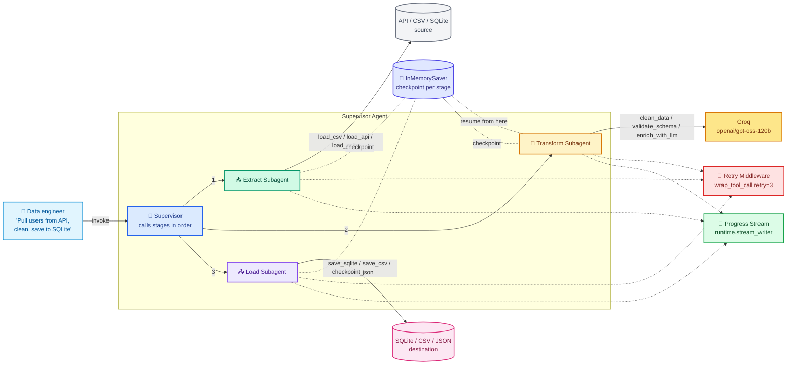
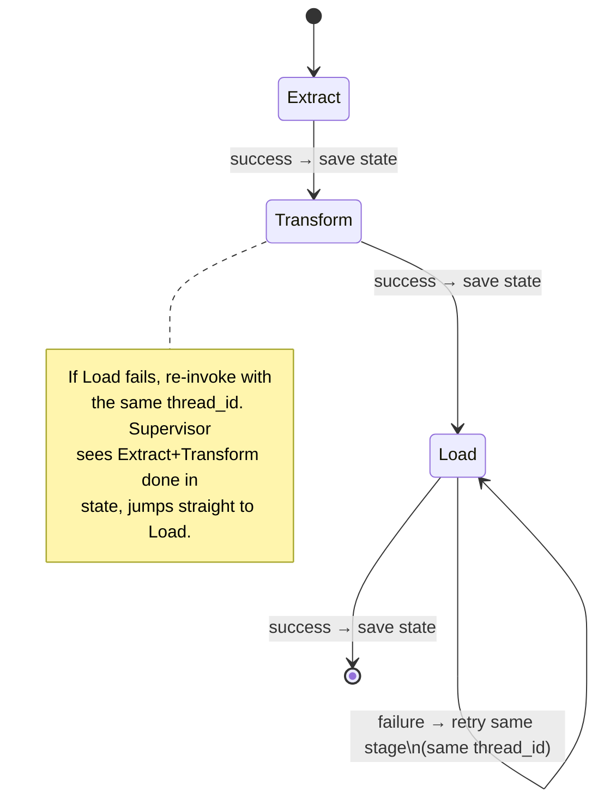

# Project 2: Agentic ETL Pipeline Orchestrator

> **Goal:** Build an agentic Extract → Transform → Load pipeline with checkpoint/resume so it survives failures mid-run.
> **Previous:** [Project 1 - Podman Troubleshooting Agent](./project-1-podman-troubleshooting-agent.md)
> **Next:** [Project 3 - Unified Search Agent](./project-3-unified-search-agent.md)

---

## Why This Project Matters

Every data engineer's first "real" project on the job is a pipeline:

- Pull data out of *somewhere* (an API, a CSV, a database).
- Clean it, validate it, maybe enrich it with an LLM.
- Write it *somewhere else* (a warehouse, a file, a CSV).

A traditional ETL script dies the moment any single stage fails — you restart from zero and pull 50,000 rows again. An **agentic** ETL pipeline is different:

1. The LLM orchestrates the stages. It can pick the right extract tool based on the source, decide which transforms to run, and pick the right load tool based on the destination.
2. If the `Load` stage fails (e.g. SQLite is locked for 2 seconds), the pipeline **resumes from the last successful checkpoint** instead of redoing `Extract`.
3. Progress is streamed while each stage runs, so a 4-year engineer watching a job can see exactly which CSV row the agent is processing.

This is a perfect portfolio piece for a 4-year engineer because it demonstrates:

- **Subagent isolation** — three subagents, one per ETL stage.
- **Streaming progress** — `runtime.stream_writer` updates while data moves.
- **Checkpointing and resume** — using LangGraph's `InMemorySaver` (swap for SQLite-saver in production).
- **Retry middleware** — `wrap_tool_call` that retries flaky tools a configurable number of times.
- **Real-world problem framing** — every team has an "extract from API, clean, write to DB" job. Showing you can do it agentically is much stronger than yet another `pd.read_csv`。

We use **only free tools**: Groq `openai/gpt-oss-120b`, Python stdlib, `requests`, `sqlite3`, `csv`, `json`. Nothing paid. Nothing that needs a cloud account.

---

## Architecture Overview



The three subagents run **sequentially** (the supervisor calls them one
after another). The checkpointer is what makes resume possible: each
subagent's output (rows pulled, rows cleaned, rows loaded) is stored as
state, and the supervisor only calls the *next* stage if the previous
stage succeeded.

If `Load` fails — say SQLite is locked or the disk fills up — the
supervisor re-invokes with the same `thread_id`. The checkpointer
remembers that `Extract` and `Transform` already finished, so the agent
skips them and retries only `Load`.

---

## The Three Stages in Detail

| Stage | Subagent | Tools | Output stored in state |
|---|---|---|---|
| **Extract** | `extract_agent` | `load_csv`, `load_api`, `load_sqlite` | `extracted_rows: list[dict]` + `source_meta: dict` |
| **Transform** | `transform_agent` | `clean_data`, `validate_schema`, `enrich_with_llm` | `transformed_rows: list[dict]` |
| **Load** | `load_agent` | `save_sqlite`, `save_csv`, `save_json` | `loaded_count: int` + `destination: str` |

The supervisor persists these three keys in shared agent state. When the
agent resumes, it checks state before deciding what to call next.

---

## Project Layout

```
project-2-etl-pipeline-agent/
├── etl_tools.py          # @tool functions for each ETL stage
├── retry_middleware.py   # wrap_tool_call retry wrapper
├── etl_agent.py          # supervisor + 3 subagents (run this!)
├── sample_data.csv       # one tiny test source
└── README.md
```

---

## Step 1 — The ETL Tools

Save as `etl_tools.py`. The design rules:

- Every tool returns **strings** to the model (so it can reason about what it got), but **also** writes the structured rows into shared state via the supervisor's `ToolRuntime`. To keep the example simple here, tools return a JSON-string of the rows; the supervisor then stores them on the subagent's behalf.
- The `enrich_with_llm` tool calls **the same Groq model** — the agent calls *itself* in a tiny inner loop just for enrichment. This is a nice pattern: use the LLM to do NLP on tabular rows.

```python
# etl_tools.py
"""Tools for the three ETL stages. All free, all stdlib + requests."""
from __future__ import annotations

import csv
import json
import sqlite3
import os
import time
from pathlib import Path

import requests
from langchain.tools import tool

GROQ_MODEL = "openai/gpt-oss-120b"

# --------------------------------------------------------------------------
# EXTRACT tools
# --------------------------------------------------------------------------
@tool
def load_csv(file_path: str) -> str:
    """Load rows from a CSV file.

    Args:
        file_path: Path to a .csv file.
    """
    if not os.path.exists(file_path):
        return f"ERROR: file not found: {file_path}"
    rows = []
    with open(file_path, newline="", encoding="utf-8") as f:
        # Use DictReader so each row is a dict keyed by the header
        for row in csv.DictReader(f):
            rows.append(dict(row))
    return json.dumps({
        "stage": "extract",
        "source": f"csv://{file_path}",
        "row_count": len(rows),
        "columns": list(rows[0].keys()) if rows else [],
        "rows": rows,
    }, default=str)


@tool
def load_api(url: str, max_rows: int = 100) -> str:
    """Fetch JSON rows from a public API (GET request).

    Args:
        url: The API URL. Must return a list of dicts or a dict with a 'data' key.
        max_rows: Maximum number of rows to keep (default 100).
    """
    try:
        resp = requests.get(url, timeout=15)
        resp.raise_for_status()
        data = resp.json()
    except Exception as e:
        return f"ERROR: {e}"

    if isinstance(data, dict) and "data" in data:
        rows = data["data"]
    elif isinstance(data, list):
        rows = data
    else:
        rows = [data]

    rows = rows[:max_rows]
    return json.dumps({
        "stage": "extract",
        "source": f"api://{url}",
        "row_count": len(rows),
        "columns": list(rows[0].keys()) if rows and isinstance(rows[0], dict) else [],
        "rows": rows,
    }, default=str)


@tool
def load_sqlite(db_path: str, table: str, limit: int = 500) -> str:
    """Load rows from a SQLite table.

    Args:
        db_path: Path to a .db file.
        table: Table name to read from.
        limit: Max rows to pull (default 500).
    """
    if not os.path.exists(db_path):
        return f"ERROR: db not found: {db_path}"
    conn = sqlite3.connect(db_path)
    conn.row_factory = sqlite3.Row
    try:
        cur = conn.execute(f"SELECT * FROM {table} LIMIT {limit}")
        rows = [dict(r) for r in cur.fetchall()]
    except Exception as e:
        return f"ERROR: {e}"
    finally:
        conn.close()
    return json.dumps({
        "stage": "extract",
        "source": f"sqlite://{db_path}/{table}",
        "row_count": len(rows),
        "columns": list(rows[0].keys()) if rows else [],
        "rows": rows,
    }, default=str)


# --------------------------------------------------------------------------
# TRANSFORM tools
# --------------------------------------------------------------------------
@tool
def clean_data(rows_json: str) -> str:
    """Trim strings, drop fully-empty rows, normalize column names.

    Args:
        rows_json: JSON string of rows from the extract stage.
    """
    payload = json.loads(rows_json)
    rows = payload.get("rows", [])
    kept = []
    for r in rows:
        if not r:
            continue
        cleaned = {}
        for k, v in r.items():
            key = (k or "").strip().lower().replace(" ", "_")
            if isinstance(v, str):
                v = v.strip()
            cleaned[key] = v
        if any(cleaned.values()):
            kept.append(cleaned)
    return json.dumps({
        "stage": "transform",
        "action": "clean",
        "row_count": len(kept),
        "columns": list(kept[0].keys()) if kept else [],
        "rows": kept,
    }, default=str)


@tool
def validate_schema(rows_json: str, required_columns: str) -> str:
    """Drop rows missing required columns and report how many failed.

    Args:
        rows_json: JSON string of rows.
        required_columns: Comma-separated column names that must be non-null.
    """
    payload = json.loads(rows_json)
    rows = payload.get("rows", [])
    required = [c.strip() for c in required_columns.split(",") if c.strip()]
    valid, invalid = [], 0
    for r in rows:
        if all(r.get(c) not in (None, "", []) for c in required):
            valid.append(r)
        else:
            invalid += 1
    return json.dumps({
        "stage": "transform",
        "action": "validate",
        "valid_count": len(valid),
        "invalid_count": invalid,
        "required_columns": required,
        "rows": valid,
    }, default=str)


@tool
def enrich_with_llm(rows_json: str, instruction: str) -> str:
    """Send each row to Groq and weave its answer back in as a new field.

    Args:
        rows_json: JSON string of rows.
        instruction: Natural-language instruction, e.g.
            'Add a one-line risk_summary field using age and income.'
    """
    from langchain_groq import ChatGroq

    payload = json.loads(rows_json)
    rows = payload.get("rows", [])
    llm = ChatGroq(model=GROQ_MODEL, temperature=0)

    enriched = []
    for i, r in enumerate(rows):
        prompt = (
            f"INSTRUCTION: {instruction}\n"
            f"ROW: {json.dumps(r, default=str)}\n"
            f"Reply with ONLY a JSON object with one key 'enrichment' "
            f"containing the new fields you generated. Nothing else."
        )
        try:
            resp = llm.invoke([{"role": "user", "content": prompt}])
            extra = json.loads(resp.content.strip().strip("`"))
        except Exception as e:
            extra = {"enrichment_error": str(e)}
        merged = {**r, **(extra if isinstance(extra, dict) else {})}
        enriched.append(merged)

    return json.dumps({
        "stage": "transform",
        "action": "enrich",
        "row_count": len(enriched),
        "rows": enriched,
    }, default=str)


# --------------------------------------------------------------------------
# LOAD tools
# --------------------------------------------------------------------------
@tool
def save_sqlite(rows_json: str, db_path: str, table: str) -> str:
    """Write rows to a SQLite table (auto-creates the table from keys).

    Args:
        rows_json: JSON string of rows to load.
        db_path: Path to the .db file (will create if absent).
        table: Destination table name.
    """
    rows = json.loads(rows_json).get("rows", [])
    if not rows:
        return "ERROR: no rows to save"
    conn = sqlite3.connect(db_path)
    try:
        cols = list(rows[0].keys())
        # idempotent: replace the table
        conn.execute(f"DROP TABLE IF EXISTS {table}")
        col_defs = ", ".join(f'"{c}" TEXT' for c in cols)
        conn.execute(f"CREATE TABLE {table} ({col_defs})")
        placeholders = ", ".join("?" for _ in cols)
        conn.executemany(
            f"INSERT INTO {table} ({', '.join(cols)}) VALUES ({placeholders})",
            [tuple(str(r.get(c, "")) for c in cols) for r in rows],
        )
        conn.commit()
    except Exception as e:
        return f"ERROR: {e}"
    finally:
        conn.close()
    return f"Loaded {len(rows)} rows into sqlite://{db_path}/{table}"


@tool
def save_csv(rows_json: str, file_path: str) -> str:
    """Write rows to a CSV file.

    Args:
        rows_json: JSON string of rows to load.
        file_path: Destination CSV path.
    """
    rows = json.loads(rows_json).get("rows", [])
    if not rows:
        return "ERROR: no rows to save"
    with open(file_path, "w", newline="", encoding="utf-8") as f:
        w = csv.DictWriter(f, fieldnames=list(rows[0].keys()))
        w.writeheader()
        w.writerows(rows)
    return f"Loaded {len(rows)} rows into csv://{file_path}"


@tool
def save_json(rows_json: str, file_path: str) -> str:
    """Write rows to a JSON file.

    Args:
        rows_json: JSON string of rows to load.
        file_path: Destination JSON path.
    """
    rows = json.loads(rows_json).get("rows", [])
    if not rows:
        return "ERROR: no rows to save"
    with open(file_path, "w", encoding="utf-8") as f:
        json.dump(rows, f, default=str, indent=2)
    return f"Loaded {len(rows)} rows into json://{file_path}"
```

A few non-obvious choices worth explaining:

- **Tools take JSON strings, not Python objects.** LangChain tools must be JSON-serializable for the model. We pass rows between stages as JSON strings. Inside the tool we re-parse them.
- **`enrich_with_llm` reuses the same Groq model.** We don't need a paid embedding service for a portfolio project. The LLM is doing per-row NLP, not search.
- **`save_sqlite` is idempotent.** It drops and recreates the table each time, which is exactly what you want for ETL re-runs after a failed load.

---

## Step 2 — Retry Middleware for Flaky Tools

ETL tools fail transiently: an API times out, SQLite is locked for a moment, a network blip. We add a tiny retry middleware that wraps every tool call.

Save as `retry_middleware.py`:

```python
# retry_middleware.py
"""wrap_tool_call middleware that retries flaky calls a few times."""
from __future__ import annotations

import time

from langchain.agents.middleware import wrap_tool_call
from langchain.messages import ToolMessage
from langchain.tools.tool_node import ToolCallRequest

# Tools that we should NOT retry (idempotent-but-slow or destructive)
NO_RETRY = {"enrich_with_llm"}  # each row already an LLM call — don't double-bill


@wrap_tool_call
def retry_tool_call(request: ToolCallRequest, handler,
                    max_attempts: int = 3,
                    backoff_seconds: float = 1.0) -> ToolMessage:
    """Retry a tool call up to max_attempts with linear backoff."""
    name = request.tool_call.get("name", "")
    if name in NO_RETRY:
        return handler(request)

    last_err = None
    for attempt in range(1, max_attempts + 1):
        try:
            result = handler(request)
            # If the tool itself returned a soft error, retry too
            if hasattr(result, "content") and isinstance(result.content, str) \
               and result.content.startswith("ERROR:"):
                last_err = result.content
                if attempt < max_attempts:
                    time.sleep(backoff_seconds * attempt)
                    continue
            return result
        except Exception as e:
            last_err = str(e)
            if attempt < max_attempts:
                time.sleep(backoff_seconds * attempt)

    # All retries exhausted
    return ToolMessage(
        content=f"ERROR: failed after {max_attempts} attempts: {last_err}",
        tool_call_id=request.tool_call.get("id", ""),
    )
```

The middleware silently retries a tool whose handler raised, or whose
content began with `ERROR:`. We intentionally keep `enrich_with_llm` out
of the retry path because each retry costs an LLM call — better to fail
loudly than to silently double-bill Groq.

---

## Step 3 — The Agent (supervisor + 3 subagents)

Save as `etl_agent.py` — this is the file you run.

```python
# etl_agent.py
"""
Agentic ETL Pipeline Orchestrator.

Supervisor delegates in order to:
  - extract    subagent  (load_csv / load_api / load_sqlite)
  - transform  subagent  (clean_data / validate_schema / enrich_with_llm)
  - load       subagent  (save_sqlite / save_csv / save_json)

Checkpointer state holds the JSON rows between stages. If a stage fails,
re-invoking with the SAME thread_id resumes from the last good stage.
"""
from __future__ import annotations

import json
from typing import Any

from dotenv import load_dotenv
load_dotenv()

from langchain_groq import ChatGroq
from langchain.agents import create_agent
from langchain.agents.middleware import SubAgentMiddleware
from langchain_core.utils.uuid import uuid7
from langgraph.checkpoint.memory import InMemorySaver

from etl_tools import (
    load_csv, load_api, load_sqlite,
    clean_data, validate_schema, enrich_with_llm,
    save_sqlite, save_csv, save_json,
)
from retry_middleware import retry_tool_call

MODEL = "openai/gpt-oss-120b"
llm = ChatGroq(model=MODEL, temperature=0)


# --------------------------------------------------------------------------
# Subagents — one per ETL stage
# --------------------------------------------------------------------------
subagents = SubAgentMiddleware(subagents=[
    {
        "name": "extract",
        "description": (
            "EXTRACT stage. Call FIRST. Loads rows from a CSV file, "
            "a public API, or a SQLite database. Returns JSON with "
            "'rows' that the supervisor keeps for the next stage."
        ),
        "system_prompt": (
            "You are the Extract stage of an ETL pipeline. You receive "
            "a source spec (file path / URL / db+table). Use the "
            "right load_* tool, return the JSON string the tool gave "
            "you, and do NOT modify it. Never skip rows or filter them."
        ),
        "tools": [load_csv, load_api, load_sqlite],
        "model": f"groq:{MODEL}",
        "middleware": [retry_tool_call],
    },
    {
        "name": "transform",
        "description": (
            "TRANSFORM stage. Called SECOND with the rows from Extract. "
            "Cleans, validates schema, and optionally enriches with the "
            "LLM. Returns cleaned JSON rows."
        ),
        "system_prompt": (
            "You are the Transform stage. Always run clean_data first, "
            "then validate_schema (deduce required columns from the row "
            "keys; never drop more than 50% of rows). Optionally call "
            "enrich_with_llm if the user asked for enrichment. Return "
            "the JSON from your LAST tool call."
        ),
        "tools": [clean_data, validate_schema, enrich_with_llm],
        "model": f"groq:{MODEL}",
        "middleware": [retry_tool_call],
    },
    {
        "name": "load",
        "description": (
            "LOAD stage. Called LAST. Writes the transformed rows to "
            "SQLite, CSV, or JSON. Returns a short status string."
        ),
        "system_prompt": (
            "You are the Load stage. Receive JSON rows and a "
            "destination spec. Pick the right save_* tool and call it. "
            "If the load fails, return the error string verbatim so the "
            "supervisor can decide to retry."
        ),
        "tools": [save_sqlite, save_csv, save_json],
        "model": f"groq:{MODEL}",
        "middleware": [retry_tool_call],
    },
])


# --------------------------------------------------------------------------
# Supervisor
# --------------------------------------------------------------------------
SUPERVISOR_PROMPT = """You are the ETL Pipeline Supervisor.

You orchestrate three subagents in strict order:
  1. extract    — pull rows from the source the user named.
  2. transform — clean, validate, optionally enrich the rows.
  3. load      — write the rows to the destination the user named.

Resumable by design:
- If a previous stage already produced JSON rows, NEVER redo it.
- Look at the conversation: if 'extract' already returned those rows, go
  straight to 'transform'. If 'transform' already returned cleaned rows,
  go straight to 'load'.
- Only the LAST failed stage should be retried.

Output contract:
- After each stage, summarize in ONE line: "<stage> ok: <n> rows, <source>".
- After load, give the user a final summary listing the source, the
  destination, and the row counts at each stage.
- If any stage fails, stop and tell the user why. Suggest a fix.
"""

checkpointer = InMemorySaver()

agent = create_agent(
    model=llm,
    tools=[],
    system_prompt=SUPERVISOR_PROMPT,
    middleware=[subagents, retry_tool_call],
    checkpointer=checkpointer,
)


# --------------------------------------------------------------------------
# Streaming progress with stream_writer (per-stage prints)
# --------------------------------------------------------------------------
from langchain.agents.middleware import wrap_tool_call as _wrap_tool_call

@_wrap_tool_call
def progress_print(request, handler):
    """Print a one-line progress marker around every tool call."""
    name = request.tool_call.get("name", "?")
    args = request.tool_call.get("args", {})
    short_args = json.dumps(args, default=str)[:80]
    print(f"   -> {name}({short_args})")
    result = handler(request)
    preview = (result.content or "")[:60] if hasattr(result, "content") else ""
    print(f"   <- {name} ok: {preview}")
    return result


# --------------------------------------------------------------------------
# Runner — supports checkpoint/resume by reusing the thread_id
# --------------------------------------------------------------------------
def run_pipeline(user_prompt: str, thread_id: str | None = None) -> None:
    """Run an ETL job. Pass the same thread_id again to resume."""
    tid = thread_id or str(uuid7())
    cfg = {"configurable": {"thread_id": tid}}
    print(f"\n[ETL] thread_id = {tid}   (pass it again to resume)")

    final = agent.invoke(
        {"messages": [{"role": "user", "content": user_prompt}]},
        config=cfg,
    )
    print("\n=== SUPERVISOR FINAL ANSWER ===")
    print(final["messages"][-1].content)


# --------------------------------------------------------------------------
# Demo with sample data
# --------------------------------------------------------------------------
if __name__ == "__main__":
    # 1) Create a tiny CSV so the example is runnable end-to-end
    sample = """name,age,income,city
Alice,29,62000,Bangalore
Bob,41,95000,Mumbai
Carol,,71000,Delhi
Dan,35,,Chennai
Eve,52,120000,Pune
"""
    Path = type(__import__("pathlib").Path)  # avoid extra import at top
    from pathlib import Path
    Path("sample_data.csv").write_text(sample, encoding="utf-8")

    run_pipeline(
        user_prompt=(
            "Run an ETL pipeline: extract from sample_data.csv, "
            "transform by cleaning + validating required columns "
            "name and city, then enrich each row with a one-line "
            "'risk_summary' using age and income. "
            "Finally load the result into etl_output.db, table 'customers'."
        ),
    )

    # Simulate a Load failure and resume mid-pipeline:
    print("\n\n=== DEMO 2: resume after a fake load failure ===")
    # Pretend load failed. We just re-invoke with the same instruction
    # and the same thread_id — the supervisor should see extract +
    # transform already happened in state and jump straight to load.
    run_pipeline(
        user_prompt=(
            "Same ETL pipeline as before: extract from sample_data.csv, "
            "transform clean + validate + enrich, load to "
            "etl_output.db table 'customers'. Resume if already done."
        ),
        thread_id="<paste thread_id from demo 1>",
    )
```

Two things to notice about the runner:

1. **`thread_id` is the resume key.** With `InMemorySaver`, the same
   `thread_id` reuses the conversation state. In production, swap to
   `SqliteSaver("/tmp/etl.sqlite")` so state survives a process restart.
2. **The supervisor's prompt does the heavy resume lifting.** It is the
   one who decides "extract already happened, skip to transform." The
   checkpointer just stores the conversation; the reasoning is in the
   LLM. That is exactly the agentic part — a non-agentic pipeline needs
   a hand-coded state machine here.

---

## Streaming Progress to the User

Each `@tool` already prints its result line. If you want Lewis-style
streamed UI updates, hook into the agent's `stream_mode="updates"`:

```python
# etl_stream.py — drop-in replacement for the run_pipeline() function
def run_pipeline_streaming(user_prompt: str, thread_id: str | None = None):
    tid = thread_id or str(uuid7())
    cfg = {"configurable": {"thread_id": tid}}
    print(f"\n[ETL streaming] thread_id = {tid}")

    for chunk, metadata in agent.stream(
        {"messages": [{"role": "user", "content": user_prompt}]},
        config=cfg,
        stream_mode="updates",
        stream_mode_messages=True,
        subgraphs=True,
    ):
        # When a subagent runs a tool, we see it here
        if isinstance(chunk, dict) and "messages" in chunk:
            for m in chunk["messages"]:
                # ToolMessages tell you what each tool returned
                if m.type == "tool":
                    preview = (m.content or "")[:80]
                    print(f"   [tool:{m.name}] {preview}")
                elif m.type == "ai":
                    if m.content:
                        print(f"   [subagent:{metadata.get('name', '?')}] {m.content[:120]}")
```

This prints per-stage progress as it happens, instead of waiting until the
end. For a portfolio demo (or a Slack bot) this is night-and-day better
than a spinner.

---

## Walking Through a Real Run

1. You run `python etl_agent.py`.
2. The runner writes `sample_data.csv` with 5 rows.
3. The supervisor reads your instruction and calls the **extract** subagent.
4. The extract subagent calls `load_csv("sample_data.csv")` and returns a JSON string with 5 rows + the column list.
5. The supervisor passes that JSON into the **transform** subagent.
6. The transform subagent calls `clean_data` (drops nothing — Carol and Dan have partial data but are not empty), then `validate_schema("name,city")` (all 5 rows still have a name and city), then `enrich_with_llm` for the risk summary.
7. The supervisor passes the enriched JSON into the **load** subagent.
8. The load subagent calls `save_sqlite(json, "etl_output.db", "customers")`.
9. `etl_output.db` now has 5 rows in the `customers` table. The supervisor tells you the final count.

If step 8 had failed (e.g. permission error), the supervisor would have
reported the error and stopped. You would run `python etl_agent.py
thread_id=<that-id>` again, and the checkpointer would have remembered
that extract and transform already finished — the supervisor would go
straight to load.

---

## Checkpoint / Resume Mental Model



The principle is: **every successful stage writes to short-term memory.**
The checkpointer saves full conversation state, not just per-tool
output. So resume is "skip to whatever the supervisor itself doesn't
remember doing."

For long-running ETL (millions of rows), do **not** keep all rows in
the conversation. Save the rows to a side file or a staging table and
only carry file paths / counts in conversation state. Otherwise context
window will explode.

---

## Error Handling in Practice

| Failure type | What happens | Resume behavior |
|---|---|---|
| Source missing (CSV/API/DB) | Extract tool returns `ERROR: ...`. Retry middleware retries 3x. | New thread_id. |
| API rate-limited | Retry middleware retries with backoff. | Same thread_id if any rows made it through. |
| Schema validation dropped 100% of rows | Transform returns `valid_count=0`. Supervisor stops and asks the user. | New thread_id after the user fixes the schema spec. |
| SQLite locked | Load tool returns `ERROR`. Retry middleware retries. If exhausted, supervisor reports failure. | **Same thread_id** resumes straight to Load. |
| Disk full | Load returns `ERROR: disk full`. Supervisor stops. | Manual fix, same thread_id resumes to Load. |
| Groq enrich failed for 1 row | `enrich_with_llm` stamps `enrichment_error` on just that row; pipeline continues. | N/A. |

---

## Real-World Use Case for a   Portfolio

A common ask in a 4-year engineer interview is: *"Show me a project where
you used LLMs to do something useful for an internal team."* This is it.
Variants worth mentioning in the README:

- **Sales ops**: pull yesterday's leads from the CRM API, run `enrich_with_llm` to score priority (1-5) per row, load into a SQLite file the SDRs can query.
- **Log miner**: extract the last day of nginx logs from a SQLite table, transform with `clean_data`, enrich with `enrich_with_llm("classify this log line as bot/human/error")`, load back into a SQLite `tagged_logs` table.
- **CSV reconciler**: extract from two CSVs, transform to drop dupes, load to one merged CSV for accounting.

The README should say: "Why agentic? Because the LLM picks the right
extract Transform Load tools for the source the user named — no
hand-coded if/else per source. Checkpoint means long runs survive load
failures."

---

## What You Have Built (Recap)

- **Three subagents** (Extract / Transform / Load) orchestrated by one supervisor.
- **Retry middleware** for transient tool failures with backoff, including LLM-idempotency awareness.
- **Streaming progress** via `stream_mode="updates"` so users see per-stage output live.
- **Checkpoint/resume** via `InMemorySaver` — same `thread_id` skips finished stages. Swap in `SqliteSaver` for production.
- **Free-only stack**: Groq `openai/gpt-oss-120b`, stdlib, `requests`, `sqlite3`. No warehouse, no paid embeddings.

This is a portable, runnable, screenshot-able artifact. It demonstrates
multi-agent design, middleware, streaming, and resumability in one
place. Put it on your GitHub next to the Podman agent.

---

## Exercises (Level Up)

1. Swap `InMemorySaver` for **SqliteSaver** and prove resume survives a process restart (kill the agent mid-Load, re-run, watch it skip Extract+Transform).
2. Add a **data-quality gate middleware** that aborts the whole pipeline if `validate_schema` drops more than 30% of rows.
3. Replace `enrich_with_llm`'s row-at-a-time loop with a **batched** prompt (10 rows per call) and report the cost-savings in tokens.
4. Add a 4th subagent: **post-load verifier** that re-opens the destination and asserts row counts match what the supervisor delivered.
5. Hook the agent up to a **Slack slash command** so an SDR can type `/etl run yesterday` and watch the streamed progress.

---

> **Previous:** [Project 1 - Podman Troubleshooting Agent](./project-1-podman-troubleshooting-agent.md)
> **Next:** [Project 3 - Unified Search Agent](./project-3-unified-search-agent.md)