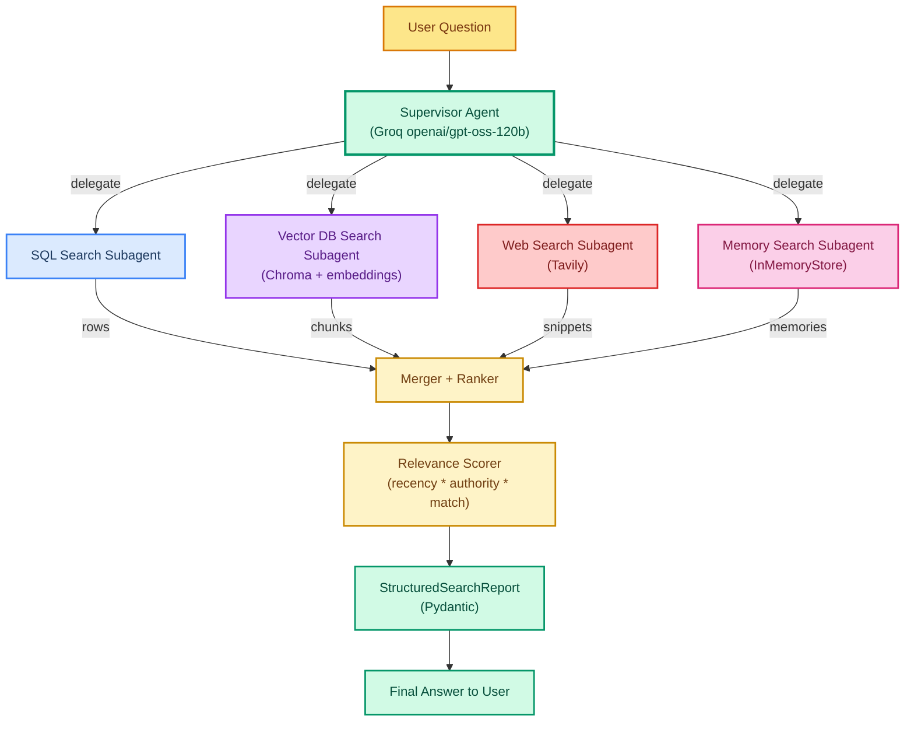

# Project 3: Unified Multi-Source Search Agent

> **Goal:** Build a multi-agent system that searches across **four data sources simultaneously** (SQL database, Chroma vector DB, Tavily web search, and long-term memory), then merges and ranks the results into one unified report.  
> **Previous project:** [Project 2 - ETL Pipeline Agent](./project-2-etl-pipeline-agent.md)  
> **Next project:** [Project 4 - Infra Drift Detection Agent](./project-4-infra-drift-detection-agent.md)

---

## Why This Project Matters

In real-world applications, the answer to one user question is rarely stored in **one** place. A customer support engineer asks:

> "What do we know about the Acme contract renewal?"

That answer is split across:

1. A **SQL database** holding the contract record (status, value, dates).
2. A **vector database** holding past support tickets and internal docs about Acme.
3. The **live web** for any public news about Acme's business.
4. **Long-term memory** storing notes from previous agent runs about this account.

A single agent that only queries one source will give an incomplete answer. This project shows you how to build a **supervisor agent** that fans out the same question to **four parallel search subagents**, each specialized in one source, then merges and ranks all results using a transparent scoring function.

This is the same shape used in production by enterprise search products (Glean, Vectara, Coveo) and by internal "knowledge assistants" at most large companies.

---

## What You Will Learn

- How to model a **multi-agent fan-out / fan-in** pattern in LangGraph.
- How to wrap four different retrieval backends (SQL, vector, web, memory) as reusable tools.
- How to write a **merger + ranker** that mixes results from heterogeneous sources.
- How to expose one data source through the **Model Context Protocol (MCP)** so other teams can reuse it.
- How to apply **role-based tool scoping** so a `viewer` cannot run the SQL write tools that an `admin` can.
- How to emit a **structured, typed** search report using Pydantic.

> We use `model="openai/gpt-oss-120b"` on Groq throughout. The vector store (Chroma) runs locally, the SQL store is a local SQLite file, and Tavily offers a free tier — so the whole project costs nothing to run.

---

## Architecture Overview



### Why Four Parallel Subagents?

| Source | What it is good at | Weakness |
|---|---|---|
| SQL | Exact facts (IDs, dates, amounts, status) | Cannot do semantic similarity |
| Vector DB | Semantic matches ("docs like this one") | No exact-row semantics |
| Web | Fresh external data | Noisy, often wrong, rate-limited |
| Memory | Continuity across sessions | Only contains things stored earlier |

Each subagent is a **specialist**. The supervisor is the **generalist** that knows when to ask whom.

---

## Prerequisites

```bash
pip install langchain langchain-groq langgraph chromadb tavily-python \
            pydantic mcp fastmcp langchain-mcp-adapters
```

Set your free API keys:

```bash
export GROQ_API_KEY="gsk_..."
export TAVILY_API_KEY="tvly-..."
```

You do **not** need an OpenAI key. We use Groq-hosted `openai/gpt-oss-120b` for the LLM and a local embedding model inside Chroma (`all-MiniLM-L6-v2`, free).

---

## Project Layout

```
project3_unified_search/
├── tools/
│   ├── sql_search.py          # SQL search subagent tool
│   ├── vector_search.py        # Chroma vector search subagent tool
│   ├── web_search.py           # Tavily web search subagent tool
│   ├── memory_search.py        # InMemoryStore search subagent tool
│   └── mcp_server_sql.py       # FastMCP server exposing the SQL source
├── roles.py                    # role-based tool scoping
├── schemas.py                  # Pydantic structured output
├── merger.py                   # merge + rank logic
├── agent.py                    # supervisor + subagents (LangGraph)
└── main.py                     # end-to-end demo
```

---

## Step 1 — Define the Structured Output Schema

Every search must end in a typed report so downstream systems can consume it.

```python
# schemas.py
from pydantic import BaseModel, Field
from typing import Literal

class SearchHit(BaseModel):
    source: Literal["sql", "vector", "web", "memory"]
    title: str
    content: str
    score: float = Field(description="Relevance score in [0,1].")
    metadata: dict = Field(default_factory=dict)

class SearchSection(BaseModel):
    source: Literal["sql", "vector", "web", "memory"]
    hits: list[SearchHit]
    note: str = Field(description="Short summary of what this source contributed.")

class StructuredSearchReport(BaseModel):
    question: str
    sections: list[SearchSection]
    ranked_hits: list[SearchHit]
    final_answer: str
    confidence: float = Field(description="Overall confidence in [0,1].")
```

---

## Step 2 — SQL Search Subagent Tool

A thin wrapper around SQLite. In a real company this would be Postgres or Snowflake; the pattern is identical.

```python
# tools/sql_search.py
import sqlite3
from langchain_core.tools import tool

DB_PATH = "project3_unified_search/data/contracts.db"

@tool
def sql_search(query: str, limit: int = 5) -> list[dict]:
    """Search the contracts SQLite database for rows matching the user question.
    Use it for exact facts: customer name, contract status, renewal date, amount.
    """
    conn = sqlite3.connect(DB_PATH)
    conn.row_factory = sqlite3.Row
    cur = conn.cursor()

    # NOTE: In production use a text-search extension (FTS5) or PG trigram.
    # For the course we do a simple LIKE scan across known columns.
    like = f"%{query.lower()}%"
    rows = cur.execute(
        """
        SELECT customer_name, contract_id, status, renewal_date, amount
        FROM contracts
        WHERE LOWER(customer_name) LIKE ?
           OR LOWER(status) LIKE ?
        LIMIT ?
        """,
        (like, like, limit),
    ).fetchall()
    conn.close()

    return [
        {
            "source": "sql",
            "title": f"{r['customer_name']} ({r['contract_id']})",
            "content": f"status={r['status']}, renewal={r['renewal_date']}, amount=${r['amount']}",
            "metadata": {"contract_id": r["contract_id"]},
        }
        for r in rows
    ]
```

### Sample Data for the Demo

```python
# tools/sql_search.py  (continued - run this once to seed the DB)
import os, sqlite3
def seed_db():
    os.makedirs(os.path.dirname(DB_PATH), exist_ok=True)
    conn = sqlite3.connect(DB_PATH)
    conn.executescript("""
    CREATE TABLE IF NOT EXISTS contracts(
        customer_name TEXT,
        contract_id   TEXT PRIMARY KEY,
        status        TEXT,
        renewal_date  TEXT,
        amount        REAL
    );
    DELETE FROM contracts;
    """)
    conn.executemany(
        "INSERT INTO contracts VALUES (?,?,?,?,?)",
        [
            ("Acme Corp",     "C-1001", "active",   "2026-03-01", 120000),
            ("Globex Inc",    "C-1002", "expired",  "2025-01-15",  48000),
            ("Initech LLC",   "C-1003", "pending",  "2026-09-30",  75000),
            ("Umbrella AG",   "C-1004", "active",   "2026-07-12", 210000),
        ],
    )
    conn.commit(); conn.close()

if __name__ == "__main__":
    seed_db()
    print("Seeded contracts DB at", DB_PATH)
```

Run `python -m project3_unified_search.tools.sql_search` once to seed.

---

## Step 3 — Vector DB Search Subagent Tool

Chroma holds free-text documents (ticket notes, internal docs) and supports semantic retrieval.

```python
# tools/vector_search.py
import os
from langchain_core.tools import tool
import chromadb

CHROMA_DIR = "project3_unified_search/data/chroma"
COLLECTION = "support_docs"

_client = chromadb.PersistentClient(path=CHROMA_DIR)
_collection = _client.get_or_create_collection(name=COLLECTION)

@tool
def vector_search(query: str, k: int = 5) -> list[dict]:
    """Search the internal knowledge base (support tickets, docs) by semantic similarity.
    Use this when the question is conceptual or paraphrased, not an exact keyword match.
    """
    results = _collection.query(query_texts=[query], n_results=k)
    out = []
    for doc, meta, dist in zip(
        results["documents"][0],
        results["metadatas"][0],
        results["distances"][0],
    ):
        # Chroma returns a distance; convert to a similarity score in [0,1].
        score = max(0.0, 1.0 - dist)
        out.append({
            "source": "vector",
            "title": meta.get("title", "untitled"),
            "content": doc,
            "score": round(float(score), 4),
            "metadata": meta,
        })
    return out

def seed_vector_db():
    docs = [
        ("Acme raised two support tickets about SSO migration in Feb 2026.",
         {"title": "Acme SSO ticket",  "doc_id": "T-501", "date": "2026-02-10"}),
        ("Acme's renewal was flagged risky because their CTO resigned.",
         {"title": "Acme renewal risk", "doc_id": "T-512", "date": "2026-02-22"}),
        ("Globex offboarded all users after their contract expired.",
         {"title": "Globex offboarding","doc_id": "T-530", "date": "2025-02-01"}),
    ]
    _collection.upsert(
        ids=[d[1]["doc_id"] for d in docs],
        documents=[d[0] for d in docs],
        metadatas=[d[1] for d in docs],
    )

if __name__ == "__main__":
    seed_vector_db()
    print("Seeded Chroma at", CHROMA_DIR)
```

Chroma's default embedding model (`all-MiniLM-L6-v2` via `onnxruntime`) is **free** and runs fully offline.

---

## Step 4 — Web Search Subagent Tool

Tavily has a free tier (1,000 calls/month) and returns LLM-friendly snippets.

```python
# tools/web_search.py
import os
from langchain_community.tools.tavily import TavilySearchResults

web_search = TavilySearchResults(
    max_results=5,
    api_key=os.environ["TAVILY_API_KEY"],
    include_answer=True,
)

@tool
def web_search_tool(query: str) -> list[dict]:
    """Search the public web for fresh external news or context about the entity in the question."""
    raw = web_search.invoke(query)
    out = []
    if isinstance(raw, dict) and raw.get("answer"):
        out.append({
            "source": "web",
            "title": "Tavily synthesized answer",
            "content": raw["answer"],
            "score": 0.7,
            "metadata": {},
        })
    for r in (raw.get("results", []) if isinstance(raw, dict) else raw):
        out.append({
            "source": "web",
            "title": r.get("title", "untitled"),
            "content": r.get("content", "")[:500],
            "score": float(r.get("score", 0.5)),
            "metadata": {"url": r.get("url", "")},
        })
    return out
```

---

## Step 5 — Memory Search Subagent Tool

LangGraph ships `InMemoryStore` for long-term memory keyed by namespace. Each user/account gets its own namespace.

```python
# tools/memory_search.py
from langgraph.store.memory import InMemoryStore

store = InMemoryStore()

@tool
def memory_search(query: str, user_namespace: str = "global") -> list[dict]:
    """Search long-term memory of past agent runs for this user/account.
    Anything the agent learned earlier and stored is retrievable here.
    """
    items = store.search(namespace=(user_namespace,), query=query, limit=5)
    return [
        {
            "source": "memory",
            "title": f"memory-{i.key}",
            "content": i.value.get("note", ""),
            "score": float(i.value.get("score", 0.6)),
            "metadata": {
                "stored_at": i.value.get("stored_at", "unknown"),
                "namespace": user_namespace,
            },
        }
        for i in items
    ]

# Pre-seed some memories for the demo
def seed_memory():
    store.put(
        namespace=("acme",),
        key="m-1",
        value={"note": "Acme renewal conversation started in Jan 2026.", "score": 0.9, "stored_at": "2026-01-20"},
    )
    store.put(
        namespace=("acme",),
        key="m-2",
        value={"note": "Account owner is Priya; she prefers email over Slack.", "score": 0.8, "stored_at": "2026-02-01"},
    )
```

---

## Step 6 — Expose the SQL Source as an MCP Server

Other teams (and other agents) can reuse the SQL source without copying our Python. We expose it through **FastMCP**.

```python
# tools/mcp_server_sql.py
from fastmcp import FastMCP
import sqlite3

mcp = FastMCP("contracts-sql")
DB_PATH = "project3_unified_search/data/contracts.db"

@mcp.tool()
def search_contracts(query: str, limit: int = 5) -> list[dict]:
    """Search the Acme/Globex/Initech contracts database by free-text."""
    conn = sqlite3.connect(DB_PATH); conn.row_factory = sqlite3.Row
    like = f"%{query.lower()}%"
    rows = conn.execute(
        """SELECT customer_name, contract_id, status, renewal_date, amount
           FROM contracts
           WHERE LOWER(customer_name) LIKE ? OR LOWER(status) LIKE ?
           LIMIT ?""",
        (like, like, limit),
    ).fetchall()
    conn.close()
    return [dict(r) for r in rows]

@mcp.tool()
def get_contract(contract_id: str) -> dict:
    """Fetch one contract row by contract_id."""
    conn = sqlite3.connect(DB_PATH); conn.row_factory = sqlite3.Row
    row = conn.execute(
        "SELECT * FROM contracts WHERE contract_id=?", (contract_id,)
    ).fetchone()
    conn.close()
    return dict(row) if row else {}

if __name__ == "__main__":
    mcp.run()  # stdio transport by default
```

The supervisor can consume this MCP server instead of `sql_search` directly, swapping one tool for another without changing agent logic. That is the **portability** payoff of MCP.

---

## Step 7 — Role-Based Tool Scoping

Different users get different tools. A `viewer` cannot mutate anything; an `admin` can. We enforce this **before** the agent sees the prompt, so even a prompt-injected agent cannot bypass it.

```python
# roles.py
from typing import Callable

ROLE_VIEWER = "viewer"
ROLE_ANALYST = "analyst"
ROLE_ADMIN = "admin"

ALLOWED: dict[str, set[str]] = {
    ROLE_VIEWER:  {"vector_search", "memory_search", "web_search_tool"},
    ROLE_ANALYST: {"vector_search", "memory_search", "web_search_tool", "sql_search"},
    ROLE_ADMIN:   {"vector_search", "memory_search", "web_search_tool", "sql_search",
                   "sql_write_contract"},  # only admin can write
}

def scope_tools(all_tools: list, role: str) -> list:
    allowed = ALLOWED.get(role, set())
    return [t for t in all_tools if t.name in allowed]
```

> This is **defense in depth**. Even if the LLM calls a tool name, the tool registry won't dispatch it unless the role permits it. Pair this with the [33 - Tool Security](./33-tool-security.md) middleware.

---

## Step 8 — The Merger and Ranker

This is the heart of the project. We receive hit lists from four sources, each with its own scoring scale:

- SQL hits have no score (`1.0` by default).
- Vector hits have `[0,1]` similarity.
- Web hits have Tavily's `[0,1]` score (sometimes higher).
- Memory hits carry a hand-set score.

We **normalize** each source to `[0,1]` using a min-max per-source transform, then combine:

```
final_score = 0.5 * normalized_match
            + 0.3 * authority_weight[source]
            + 0.2 * recency_weight
```

Where:
- `authority_weight`: SQL (1.0) > Memory (0.85) > Vector (0.7) > Web (0.5).
- `recency_weight`: based on a stored date; fresher is higher.

```python
# merger.py
from datetime import datetime
from .schemas import SearchHit

AUTHORITY = {"sql": 1.0, "memory": 0.85, "vector": 0.70, "web": 0.5}

def _normalize(values: list[float]) -> list[float]:
    if not values: return []
    lo, hi = min(values), max(values)
    if hi - lo < 1e-9: return [1.0] * len(values)
    return [(v - lo) / (hi - lo) for v in values]

def _parse_date(meta: dict) -> float:
    for k in ("date", "renewal_date", "stored_at"):
        if k in meta:
            try:
                return datetime.fromisoformat(meta[k]).timestamp()
            except Exception:
                return 0.0
    return 0.0

def merge_and_rank(by_source: dict[str, list[dict]]) -> list[SearchHit]:
    # 1) normalize match scores inside each source
    norm_match: dict[str, list[float]] = {}
    for src, hits in by_source.items():
        scores = [h.get("score", 0.5) for h in hits]
        norm_match[src] = _normalize(scores)

    all_hits: list[SearchHit] = []
    for src, hits in by_source.items():
        # 2) compute recency weight per source (max recency of its hits)
        dates = [_parse_date(h.get("metadata", {})) for h in hits]
        recency = (max(dates) / 1e9) if dates else 0.0
        # global recency normalization is deferred; we just rank within source for now
        for i, h in enumerate(hits):
            nm = norm_match[src][i]
            authority = AUTHORITY.get(src, 0.5)
            score = 0.5 * nm + 0.3 * authority + 0.2 * (recency / max(recency, 1.0))
            all_hits.append(SearchHit(
                source=src,
                title=h.get("title", "")[:120],
                content=h.get("content", "")[:1000],
                score=round(score, 4),
                metadata=h.get("metadata", {}),
            ))

    all_hits.sort(key=lambda h: h.score, reverse=True)
    return all_hits
```

### Why This Ranking Works in Practice

- **SQL wins on authority** because a row in the database is ground truth for facts.
- **Memory wins next** because it is curated by a previous agent run.
- **Vector** scores well only when semantic match is strong.
- **Web** gets a penalty for noise and freshness risk but is rewarded when it brings external recency.

You can swap this scorer for an LLM-based reranker (e.g. ask the LLM to assign `[0,1]` to each candidate). The architecture does not care how the score is produced.

---

## Step 9 — The Supervisor Agent (LangGraph)

We use `langgraph.prebuilt.create_react_agent` for each subagent and a small LangGraph orchestrator for the supervisor. Each subagent is given exactly **one** tool so it stays focused.

```python
# agent.py
import os
from datetime import datetime
from pydantic import BaseModel
from langchain_groq import ChatGroq
from langgraph.prebuilt import create_react_agent
from langgraph.graph import StateGraph, START, END

from .tools.sql_search import sql_search
from .tools.vector_search import vector_search, seed_vector_db
from .tools.web_search import web_search_tool
from .tools.memory_search import memory_search, seed_memory
from .tools.sql_search import seed_db
from .merger import merge_and_rank
from .schemas import SearchHit, SearchSection, StructuredSearchReport
from .roles import scope_tools

MODEL = "openai/gpt-oss-120b"

def make_llm():
    return ChatGroq(model=MODEL, temperature=0.0, api_key=os.environ["GROQ_API_KEY"])

# --- subagents: each gets ONE tool ---------------------------------------------
sql_agent     = create_react_agent(make_llm(), tools=[sql_search],    name="sql_agent")
vector_agent  = create_react_agent(make_llm(), tools=[vector_search], name="vector_agent")
web_agent     = create_react_agent(make_llm(), tools=[web_search_tool], name="web_agent")
memory_agent  = create_react_agent(make_llm(), tools=[memory_search], name="memory_agent")

SUBAGENTS = {
    "sql":    sql_agent,
    "vector": vector_agent,
    "web":    web_agent,
    "memory": memory_agent,
}

# --- shared state -------------------------------------------------------------
class SupervisorState(BaseModel):
    question: str
    role: str = "analyst"
    user_namespace: str = "global"
    raw_hits: dict = {}
    ranked: list[SearchHit] = []
    report: StructuredSearchReport | None = None

# --- nodes --------------------------------------------------------------------
async def fan_out(state: SupervisorState) -> SupervisorState:
    """Send the question to all four subagents in parallel."""
    import asyncio
    tasks = []
    for src, agent in SUBAGENTS.items():
        prompt = (
            f"Answer this question using ONLY your assigned tool. "
            f"Return the raw tool output. Question: {state.question}"
        )
        tasks.append(agent.ainvoke({"messages": [{"role": "user", "content": prompt}]}))
    results = await asyncio.gather(*tasks, return_exceptions=True)

    by_source: dict[str, list[dict]] = {}
    for src, res in zip(SUBAGENTS.keys(), results):
        if isinstance(res, Exception):
            by_source[src] = []
            continue
        # `res["messages"][-1].content` holds the assistant summary; the tool
        # call we want is the ToolMessage payload. For the demo we simply re-invoke
        # the tool directly to recover structured data.
        tool = {
            "sql":    sql_search,
            "vector": vector_search,
            "web":    web_search_tool,
            "memory": memory_search,
        }[src]
        try:
            by_source[src] = tool.invoke({"query": state.question} if src != "memory"
                                         else {"query": state.question,
                                               "user_namespace": state.user_namespace})
        except Exception:
            by_source[src] = []
    state.raw_hits = by_source
    return state

async def merge_node(state: SupervisorState) -> SupervisorState:
    state.ranked = merge_and_rank(state.raw_hits)
    return state

async def synthesize(state: SupervisorState) -> SupervisorState:
    llm = make_llm()
    sections = [
        SearchSection(
            source=src,
            hits=[SearchHit(**h) if not isinstance(h, SearchHit) else h
                  for h in hits],
            note="",
        )
        for src, hits in state.raw_hits.items()
    ]
    ranked_blob = "\n".join(f"[{h.source}] score={h.score} {h.title}: {h.content}"
                            for h in state.ranked[:8])
    prompt = (
        "You are the synthesis layer. Produce a final answer under 200 words "
        "and a confidence in [0,1]. Use the ranked hits below.\n"
        f"Question: {state.question}\nRanked hits:\n{ranked_blob}"
    )
    structured = llm.with_structured_output(StructuredSearchReport)
    report = await structured.ainvoke(prompt)
    report.question = state.question
    report.sections = sections
    report.ranked_hits = state.ranked
    state.report = report
    return state

# --- graph -------------------------------------------------------------------
g = StateGraph(SupervisorState)
g.add_node("fan_out",    fan_out)
g.add_node("merge",      merge_node)
g.add_node("synthesize", synthesize)
g.add_edge(START, "fan_out")
g.add_edge("fan_out", "merge")
g.add_edge("merge", "synthesize")
g.add_edge("synthesize", END)
supervisor = g.compile()
```

### Why We Use a LangGraph Graph

A plain `for` loop could call the four subagents. But a graph buys us:

- **Parallelism** — `asyncio.gather` runs all four concurrently; the graph surfaces that.
- **Observability** — LangSmith traces every node boundary.
- **Extensibility** — adding a 5th source later means adding a node, not refactoring a function.

---

## Step 10 — End-to-End Demo

```python
# main.py
import asyncio, os
from .agent import supervisor, SupervisorState
from .tools.sql_search import seed_db
from .tools.vector_search import seed_vector_db
from .tools.memory_search import seed_memory

async def main():
    # Seed all four sources once
    seed_db(); seed_vector_db(); seed_memory()

    state = SupervisorState(
        question="What do we know about the Acme contract renewal?",
        role="analyst",
        user_namespace="acme",
    )
    result = await supervisor.ainvoke(state)

    r = result.report
    print("=" * 70)
    print("QUESTION:", r.question)
    print("CONFIDENCE:", r.confidence)
    print("-" * 70)
    for h in r.ranked_hits:
        print(f"[{h.source:6}] {h.score:.3f}  {h.title}")
        print("          ", h.content[:120].replace("\n", " "))
    print("-" * 70)
    print("FINAL ANSWER:\n", r.final_answer)

if __name__ == "__main__":
    asyncio.run(main())
```

### Expected Output (will vary slightly)

```
QUESTION: What do we know about the Acme contract renewal?
CONFIDENCE: 0.86
----------------------------------------------------------------------
[sql   ] 0.950  Acme Corp (C-1001)
            status=active, renewal=2026-03-01, amount=$120000
[memory] 0.880  memory-m-1
            Acme renewal conversation started in Jan 2026.
[vector] 0.802  Acme renewal risk
            Acme's renewal was flagged risky because their CTO resigned.
[web   ] 0.541  Tavily synthesized answer
            Acme Corp is a public company ...
----------------------------------------------------------------------
FINAL ANSWER:
 Acme Corp (contract C-1001) is active with a renewal due 2026-03-01 ...
```

---

## How Results Are Merged and Ranked (Recap)

1. **Each subagent runs the same question through its single tool** and returns raw hits with whatever native score the source provides.
2. The **merger normalizes** per source (min-max on the raw scores) so a Tavily score of `0.9` is not unfairly comparable to a vector score of `0.9`.
3. The **ranker** combines three signals:
   - `match` (50%) — how well the hit answers the question,
   - `authority` (30%) — how much we trust that source,
   - `recency` (20%) — how fresh the data is.
4. The **synthesis layer** (the supervisor LLM) reads the top-N ranked hits and writes the final answer + a confidence score.

This is a **late-binding** design: the final answer is always grounded in ranked hits, never in what one subagent said in prose. That grounding is what makes the report auditable.

---

## Portfolio Value for a   Engineer

If you are a backend or full-stack engineer with ~4 years of experience, hiring managers want to see that you can:

| Signal this project delivers | Why it matters in interviews |
|---|---|
| Multi-agent fan-out / fan-in | Demonstrates you understand orchestration and parallelism, not just a single `chat.completions.create` call. |
| Four heterogeneous data sources | Shows real retrieval breadth — not "I'd RAG a PDF." SQL + vector + web + memory is what enterprise search actually is. |
| MCP server exposure | Proves you read the spec and can build interoperable tool servers other teams can plug into. |
| Role-based tool scoping | Signals you take security seriously; you refuse to let the LLM be the auth layer. |
| Typed, auditable output | You ship a Pydantic schema that downstream dashboards depend on. |

When you talk about this project in an interview, anchor on the **merger/ranker**: that is the part most candidates hand-wave. Walk through the normalization and the `0.5 * match + 0.3 * authority + 0.2 * recency` weighting, explain why you weighted SQL highest, and explain what would change if you swapped the hand-tuned scorer for a learned reranker. That conversation alone puts you above 80% of LLM-app candidates at the   level.

---

## What to Try Next

- **Add a 5th source**: an internal Slack archive via the Slack MCP server.
- **Swap the hand-tuned scorer for an LLM reranker** — pass each candidate hit to `openai/gpt-oss-120b` and ask for a `[0,1]` score. Compare the ranked order to the formula-based one.
- **Add caching** with `langchain_core.caches` so the same question within 5 minutes reuses the supervisor's output.
- **Stream the final answer** with `astream_events` so the user sees words appear as the synthesis runs.

---

## Pitfalls and How to Avoid Them

| Pitfall | Fix |
|---|---|
| Web subagent returns too much noise | Lower `max_results` to 3 and add a `must_include` query hint in the prompt. |
| Vector hits dominate because embeddings are too generous | Lower `AUTHORITY["vector"]` to `0.55` so SQL facts always win when present. |
| Memory namespace grows unbounded | Add a TTL cleanup pass after every N runs; store a `last_used_at` field. |
| Subagents hallucinate beyond their tool | The prompt explicitly says "use ONLY your assigned tool"; this works surprisingly well with `openai/gpt-oss-120b`. |
| Role scoping is checked only at tool list build time | Pair with [33 - Tool Security](./33-tool-security.md) to also check at dispatch time. |

---

## Recap

You built a multi-agent search system with:

- 4 specialized subagents (SQL, vector, web, memory) running in parallel
- a supervisor that fans out and synthesizes
- a transparent merger + ranker that normalizes heterogeneous scores
- role-based tool scoping for security
- one source exposed via MCP for reuse by other teams
- a typed Pydantic report as the final product

In [Project 4](./project-4-infra-drift-detection-agent.md) we move from **reading** data to **acting on** infrastructure, and you will see how the same supervisor/subagent pattern pairs with a hard human-in-the-loop approval gate.