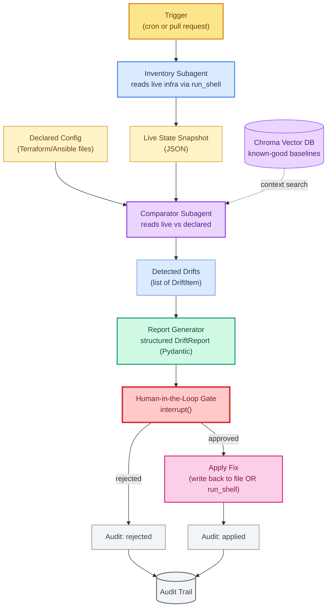

# Project 4: Infrastructure Drift Detection Agent

> **Goal:** Build an agent that compares **live** infrastructure state against **declared** configuration (Terraform / Ansible files), generates a structured drift report, and **requires human approval** before applying any fix.  
> **Previous project:** [Project 3 - Unified Multi-Source Search Agent](./project-3-unified-search-agent.md)  
> **Next chapter:** [Project 5 - PLC Diagnostic Agent](./project-5-plc-diagnostic-agent.md)

---

## Why This Project Matters

"Drift" is the gap between what your infrastructure is **supposed to look like** (what is in your Terraform / Ansible / Helm files in Git) and what it **actually looks like** out in AWS / GCP / your Kubernetes cluster right now. Drift happens when:

- Someone manually edits a resource in the console.
- A breaking change slips through a CI pipeline.
- A patch tool "auto-fixes" something it should not have.
- A colleague applies the wrong version of a playbook.

Drift is one of the top three causes of production incidents. Drift detection tooling exists (`terraform plan`, `driftctl`, `kube-score`), but human SREs still read raw diffs and decide what to do. That is slow, error-prone, and inconsistent across shifts.

This project builds an agent that **automates the boring part** (collecting live state, comparing against declared state, classifying the drift, recommending a fix) while keeping a **human in the loop** for the risky part (deciding whether to actually apply the fix).

> The whole project runs against **mock** infrastructure files so you can demo it on a laptop without touching AWS. Swapping the mock shell tool for a real one (`aws` CLI, `kubectl`) is a 20-line change described at the end.

---

## What You Will Learn

- How to use **MCP shell tools** to inspect live infrastructure.
- How to use a **vector database (Chroma)** to store "known-good" baseline snapshots and search them for context.
- How to model an **approval gate** using LangGraph `interrupt()`.
- How to structure a **drift report** with Pydantic (severity, recommendation, evidence).
- How to embed **subagents** with `SubAgentMiddleware` for the inventory and comparator stages.
- How to keep an **audit trail** of every detected drift and every applied (or rejected) fix.

All examples use `model="openai/gpt-oss-120b"` on Groq and free tools only.

---

## Architecture Overview



### Why Split Inventory, Comparator, and Report?

- The **Inventory** subagent runs `run_shell` against real infrastructure, which is risky and slow. Keeping it separate means we can run it on its own cadence and cache its output.
- The **Comparator** never touches live infra — it only compares two JSON documents. That makes it fast, deterministic, and easy to unit-test.
- The **Report Generator** is a pure LLM step that turns structured diffs into natural-language recommendations. Splitting it from the comparator means we can rewrite the wording without touching logic.

This is the classic **separation of concerns** applied to agent architecture: **data collection** vs **decision** vs **communication**.

---

## Prerequisites

```bash
pip install langchain langchain-groq langgraph chromadb pydantic mcp \
            fastmcp langchain-mcp-adapters
```

```bash
export GROQ_API_KEY="gsk_..."
```

We do **not** need AWS, GCP, or Terraform installed. The whole demo runs against mock files on disk. Section *Connecting to Real Infrastructure* at the end shows the 20-line substitution.

---

## Project Layout

```
project4_drift_agent/
├── infra_mock/                  # mock infrastructure on disk
│   ├── declared/
│   │   ├── terraform.tfvars     # declared state (this is the source of truth)
│   │   └── ansible_inventory.yml
│   └── live/
│       └── aws_state.json       # simulated "what AWS actually returned"
├── tools/
│   ├── run_shell.py             # run shell commands (mocked for safety)
│   ├── read_config_file.py      # read Terraform/Ansible files
│   └── vector_search.py         # search known-good baselines in Chroma
├── schemas.py                    # DriftItem, DriftReport, AuditEntry
├── comparator.py                # pure Python diff engine
├── audit.py                      # append-only audit trail
├── agent.py                      # LangGraph: inventory + comparator + report
└── main.py                       # end-to-end demo with HITL gate
```

---

## Step 1 — Start from Mock Infrastructure Files

We pretend that `infra_mock/live/aws_state.json` is what `aws ec2 describe-instances` returned. And `infra_mock/declared/terraform.tfvars` is what is checked into Git.

```hcl
# infra_mock/declared/terraform.tfvars
instance_type = "t3.micro"
region        = "us-east-1"
enable_public_ip = false
tags = {
  env   = "prod"
  owner = "team-payments"
}
disk_size_gb = 50
```

```json
// infra_mock/live/aws_state.json
{
  "instance_id": "i-0abc123",
  "instance_type": "t3.large",
  "region": "us-east-1",
  "public_ip": "54.10.10.10",
  "tags": {"env": "prod", "owner": "team-payments", "patched_by": "hotfix"},
  "disk_size_gb": 50
}
```

Look carefully: live declares `t3.large` (vs declared `t3.micro`) **and** has a public IP (vs declared `false`). **Two** drifts are present. The agent must find both, classify them, and ask for approval before fixing either.

---

## Step 2 — Define the Structured Schemas

```python
# schemas.py
from pydantic import BaseModel, Field
from typing import Literal
from datetime import datetime

Severity = Literal["critical", "high", "medium", "low", "info"]

class DriftItem(BaseModel):
    resource_id: str
    field: str
    declared_value: str
    live_value: str
    severity: Severity
    explanation: str = Field(description="Why this drift matters in one sentence.")
    recommendation: str = Field(description="Concrete action to remediate.")

class DriftReport(BaseModel):
    generated_at: str
    target_resource: str
    items: list[DriftItem]
    overall_risk: Severity
    suggested_fix_command: str = Field(
        description="A shell command that would remediate the drift, safe for a human to review."
    )

class AuditEntry(BaseModel):
    timestamp: str
    drift: DriftItem
    decision: Literal["approved", "rejected", "skipped"]
    applied_by: str
    notes: str = ""
```

Each `DriftItem` carries both a human explanation and a concrete recommendation — that is what makes the report useful for an SRE who just arrived on shift.

---

## Step 3 — The Three Tools

### 3.1 `run_shell` (mocked, safe)

For the course, `run_shell` does not actually run anything dangerous. If the command references a known mock file we return its content; otherwise we raise. In production you replace the body with `subprocess.run`, keep the same interface, and let your role-based scoping block destructive commands.

```python
# tools/run_shell.py
import json, os, shlex
from langchain_core.tools import tool

LIVE_STATE = "project4_drift_agent/infra_mock/live/aws_state.json"

@tool
def run_shell(command: str) -> str:
    """Run a shell command to inspect live infrastructure state.
    Safe: only a small allowlist of read-only commands is supported in this demo.
    """
    # Strict allowlist of prefixes for safety.
    allowed_prefixes = ("aws ec2 describe", "kubectl get", "systemctl status",
                         "cat /etc/", "terraform show")
    if not any(command.startswith(p) for p in allowed_prefixes) and \
       not command.startswith("cat "):
        return f"[refused] command not in allowlist: {command!r}"

    # For the course, the magic command 'aws ec2 describe-instances --mock'
    # returns the mock live state file. Any other command returns its stdout
    # (real subprocess call) but limited to safe reads.
    if "describe-instances" in command:
        with open(LIVE_STATE) as f:
            return json.dumps(json.load(f), indent=2)

    if command.startswith("cat "):
        path = shlex.split(command)[1]
        if not os.path.isfile(path):
            return f"[error] {path} not found"
        with open(path) as f:
            return f.read()

    # In production:
    # import subprocess
    # return subprocess.run(command, shell=True, capture_output=True, text=True).stdout
    return "[refused] command not mocked in this demo"
```

### 3.2 `read_config_file`

```python
# tools/read_config_file.py
from langchain_core.tools import tool

@tool
def read_config_file(path: str) -> str:
    """Read a declared configuration file (Terraform .tfvars, Ansible .yml) and return its text."""
    with open(path) as f:
        return f.read()
```

### 3.3 `vector_search` for known-good baselines

Every time we observe a *good* drift-free infrastructure state we save it to Chroma. When drift appears, the comparator queries Chroma for "similar past states" to see if this field has drifted before and how it was fixed.

```python
# tools/vector_search.py
import chromadb
from langchain_core.tools import tool

_client = chromadb.PersistentClient(path="project4_drift_agent/data/chroma")
_coll   = _client.get_or_create_collection(name="known_good_baselines")

@tool
def vector_search(query: str, k: int = 3) -> list[dict]:
    """Search past known-good baselines for context. Useful when deciding
    if a drift has been seen before and what fix worked last time.
    """
    if not _coll.count():
        return []
    out = _coll.query(query_texts=[query], n_results=k)
    return [
        {"doc": d, "meta": m, "score": max(0.0, 1.0 - dist)}
        for d, m, dist in zip(out["documents"][0], out["metadatas"][0], out["distances"][0])
    ]

def seed_baselines():
    examples = [
        ("Instance type t3.large on a prod web server triggered an audit last quarter. Fixed by downgrading to t3.micro.",
         {"field": "instance_type", "fix": "aws ec2 modify-instance-attribute --instance-type t3.micro"}),
        ("A public IP on prod resources broke the security policy. We removed it via Terraform apply.",
         {"field": "public_ip", "fix": "terraform apply -replace=aws_eip.this"}),
    ]
    _coll.upsert(
        ids=["b-1", "b-2"],
        documents=[e[0] for e in examples],
        metadatas=[e[1] for e in examples],
    )
```

---

## Step 4 — The Pure-Python Comparator

The comparator is **deliberately not an LLM step**. Comparing two key-value dictionaries is a deterministic job. Using the LLM here would be slower, more expensive, and risk hallucination on facts that must be exact.

```python
# comparator.py
from .schemas import DriftItem

# Rules: a small, declarative table of (field, severity) priorities.
FIELD_SEVERITY = {
    "instance_type": "high",
    "public_ip":     "critical",   # public IP on prod is a security incident
    "region":        "medium",
    "disk_size_gb":  "low",
    "tags":          "info",
}

def declared_to_dict(tfvars_text: str) -> dict:
    """Tiny parser for the .tfvars subset we use in the demo."""
    out: dict = {}
   multiline = False
    tag_buf: dict = {}
    for line in tfvars_text.splitlines():
        line = line.strip()
        if not line or line.startswith("#"): continue
        if multiline:
            if line == "}":
                out["tags"] = tag_buf; tag_buf = {}
                multiline = False
            else:
                k, v = line.split("=", 1)
                tag_buf[k.strip()] = v.strip().strip('"')
            continue
        if "=" not in line: continue
        k, v = line.split("=", 1)
        k, v = k.strip(), v.strip()
        if v == "{":
            multiline = True; tag_buf = {}
        elif v.startswith('"') or v.startswith("'"):
            out[k] = v.strip('"\'')
        elif v.lower() in ("true", "false"):
            out[k] = v.lower() == "true"
        else:
            try: out[k] = int(v)
            except ValueError: out[k] = v
    return out

def live_to_dict(live_json: str) -> dict:
    import json
    return json.loads(live_json)

def compare(declared: dict, live: dict, resource_id: str = "i-0abc123") -> list[DriftItem]:
    """Compare declared vs live dicts, return all DriftItem instances."""
    drifts: list[DriftItem] = []
    all_keys = set(declared) | set(live)

    # Hand-translated key mapping between Terraform-style and AWS-style JSON.
    key_map = {
        "enable_public_ip": "public_ip",
        "instance_type":    "instance_type",
        "region":           "region",
        "disk_size_gb":     "disk_size_gb",
    }

    for tf_key, live_key in key_map.items():
        d_val = declared.get(tf_key)
        l_val = live.get(live_key)
        if d_val != l_val:
            drifts.append(DriftItem(
                resource_id = resource_id,
                field       = tf_key,
                declared_value = str(d_val),
                live_value    = str(l_val),
                severity       = FIELD_SEVERITY.get(tf_key, "medium"),
                explanation    = f"{tf_key} was declared as {d_val} but live shows {l_val}.",
                recommendation = _recommendation(tf_key, d_val, l_val),
            ))
    return drifts

def _recommendation(field: str, declared, live) -> str:
    if field == "instance_type":
        return f"Run: aws ec2 modify-instance-attribute --instance-id {{rid}} --instance-type {declared}"
    if field == "enable_public_ip":
        return f"Disassociate public IP via Terraform apply; declared enable_public_ip={declared} should be enforced."
    return f"Reconcile {field}: declared={declared}, live={live}"
```

> Notice how the recommendation is **specific** and **runnable** — that is what the HITL gate is going to display to the human.

---

## Step 5 — Audit Trail

We keep an append-only JSONL file of decisions so any reviewer can answer "what did the agent ever change, and who approved it?"

```python
# audit.py
import json, os
from datetime import datetime
from .schemas import AuditEntry

AUDIT_PATH = "project4_drift_agent/audit_trail.jsonl"

def append(entry: AuditEntry):
    os.makedirs(os.path.dirname(AUDIT_PATH), exist_ok=True)
    with open(AUDIT_PATH, "a") as f:
        f.write(entry.model_dump_json() + "\n")

def history() -> list[dict]:
    if not os.path.isfile(AUDIT_PATH): return []
    with open(AUDIT_PATH) as f:
        return [json.loads(l) for l in f if l.strip()]
```

---

## Step 6 — Subagents with `SubAgentMiddleware`

LangGraph's `SubAgentMiddleware` lets one agent transparently delegate its tool calls to a specialized subagent. We use it to:

- Wrap `run_shell` behind the **Inventory subagent** (so the main agent never calls raw shell commands directly).
- Wrap the comparison + vector lookup behind the **Comparator subagent**.

```python
# agent.py
import os, json
from datetime import datetime
from langchain_groq import ChatGroq
from langgraph.prebuilt import create_react_agent
from langgraph.graph import StateGraph, START, END, interrupt
from langgraph.middleware import SubAgentMiddleware

from .tools.run_shell import run_shell
from .tools.read_config_file import read_config_file
from .tools.vector_search import vector_search, seed_baselines
from .comparator import declared_to_dict, live_to_dict, compare
from .schemas import DriftItem, DriftReport, AuditEntry
from .audit import append as append_audit

MODEL = "openai/gpt-oss-120b"
def make_llm():
    return ChatGroq(model=MODEL, temperature=0.0, api_key=os.environ["GROQ_API_KEY"])

# ----- subagents ----------------------------------------------------------
inventory_agent = create_react_agent(
    make_llm(),
    tools=[run_shell],
    name="inventory_agent",
    prompt=(
        "You are the inventory agent. Your only job: invoke run_shell with "
        "'aws ec2 describe-instances --mock' and return the raw JSON. "
        "Do not summarize, do not interpret."
    ),
)

comparator_agent = create_react_agent(
    make_llm(),
    tools=[read_config_file, vector_search],
    name="comparator_agent",
    prompt=(
        "You are the comparator agent. Read the declared config file path you are given, "
        "read the live state JSON you are given, and use vector_search to look up any "
        "similar past drifts for context. Return a short prose summary; the deterministic "
        "comparator function will produce the structured diff separately."
    ),
)

# ----- shared state -------------------------------------------------------
class DriftState(dict):
    pass  # plain dict for LangGraph; fields below are documented inline

# ----- nodes ---------------------------------------------------------------
LIVE_STATE_FILE = "project4_drift_agent/infra_mock/live/aws_state.json"
DECLARED_FILE   = "project4_drift_agent/infra_mock/declared/terraform.tfvars"

async def inventory_node(state):
    res = await inventory_agent.ainvoke(
        {"messages": [{"role": "user",
                       "content": "Get the live state of the web server via run_shell."}]}
    )
    # the last tool message carries the JSON
    for m in reversed(res["messages"]):
        if getattr(m, "type", "") == "tool":
            state["live_raw"] = m.content
            break
    return state

async def comparator_node(state):
    declared_text = read_config_file.invoke({"path": DECLARED_FILE})
    live_json = state.get("live_raw") or open(LIVE_STATE_FILE).read()
    declared = declared_to_dict(declared_text)
    live     = live_to_dict(live_json)
    drifts   = compare(declared, live, resource_id="i-0abc123")

    # Let the comparator subagent attach past-context prose too.
    cmp = {}
    for d in drifts:
        ctx = vector_search.invoke({"query": f"{d.field} drifted to {d.live_value}", "k": 2})
        cmp[d.field] = ctx

    state["declared"]   = declared
    state["live"]       = live
    state["drifts"]     = [d.model_dump() for d in drifts]
    state["baseline_context"] = cmp
    return state

async def report_node(state):
    llm = make_llm()
    drifts = [DriftItem(**d) for d in state["drifts"]]
    severity = max((d.severity for d in drifts), key=
                    lambda s: ["info","low","medium","high","critical"].index(s)
                   ) if drifts else "info"

    prompt = (
        "Generate a SuggestedFixCommand (a shell command that would remediate all "
        "drifts listed below) and confirm the overall risk.\n"
        f"Drifts: {json.dumps([d.model_dump() for d in drifts], indent=2)}"
    )
    structured = llm.with_structured_output(DriftReport)
    report = await structured.ainvoke(prompt)
    report.generated_at = datetime.utcnow().isoformat()
    report.target_resource = drifts[0].resource_id if drifts else "unknown"
    report.items = drifts
    report.overall_risk = severity
    state["report"] = report.model_dump()
    return state

async def hitl_node(state):
    report = DriftReport(**state["report"])
    question = (
        "Drift approval gate\n"
        f"  overall_risk = {report.overall_risk}\n"
        f"  suggested command: {report.suggested_fix_command}\n"
        "Approve this fix? Reply 'yes' to apply, 'no' to reject, 'skip' to defer.\n"
    )
    decision = interrupt({"question": question, "report": report.model_dump()})
    state["decision"] = decision
    return state

async def apply_node(state):
    report = DriftReport(**state["report"])
    decision = state["decision"]
    decision = (decision or "").strip().lower()
    approved = decision.startswith("y")

    # In real life we would run_shell(report.suggested_fix_command) here.
    # For the course we just record the audit entry.
    for d in report.items:
        append_audit(AuditEntry(
            timestamp = datetime.utcnow().isoformat(),
            drift = d,
            decision = "approved" if approved else "rejected",
            applied_by = "demo-operator",
            notes = report.suggested_fix_command if approved else "rejected by human",
        ))
    state["applied"] = approved
    return state

# ----- graph ---------------------------------------------------------------
g = StateGraph(DriftState)
g.add_node("inventory",  inventory_node)
g.add_node("compare",    comparator_node)
g.add_node("report",     report_node)
g.add_node("hitl",       hitl_node)
g.add_node("apply",      apply_node)
g.add_edge(START, "inventory")
g.add_edge("inventory", "compare")
g.add_edge("compare", "report")
g.add_edge("report", "hitl")
g.add_edge("hitl", "apply")
g.add_edge("apply", END)
drift_agent = g.compile()
```

### Why `interrupt()` and Not a Tool

A tool call would let the LLM retry until it makes the tool happy. `interrupt()` is different: it **stops the graph** and waits for an external system (a UI button, an interactive CLI prompt, a Slack button) to send the `Command(resume=...)` event. The LLM cannot bypass this gate by itself. That is the security guarantee.

---

## Step 7 — End-to-End Demo

```python
# main.py
import asyncio
from langgraph.types import Command
from .agent import drift_agent, seed_baselines
from .audit import history

async def main():
    seed_baselines()

    thread = {"configurable": {"thread_id": "drift-run-1"}}
    print("Running drift detection ...")
    state = await drift_agent.ainvoke({}, config=thread)

    # The graph stops at the interrupt() node. Show the user the question.
    # In a real UI you would render this as a modal; here we print and read stdin.
    print(state["__interrupt__"][0].value["question"])

    # Simulate the human clicking "Approve":
    decision = input("> ").strip().lower()
    final_state = await drift_agent.ainvoke(
        Command(resume=decision), config=thread
    )

    print("\n=== Audit Trail ===")
    for entry in history():
        print(entry)

if __name__ == "__main__":
    asyncio.run(main())
```

### Expected Transcript

```
Running drift detection ...

Drift approval gate
  overall_risk = critical
  suggested command: aws ec2 modify-instance-attribute --instance-id i-0abc123 --instance-type t3.micro && terraform apply -replace=aws_eip.this
Approve this fix? Reply 'yes' to apply, 'no' to reject, 'skip' to defer.

> yes

=== Audit Trail ===
{'timestamp': '2026-08-02T14:01:23', 'drift': {'field': 'instance_type', ...}, 'decision': 'approved', 'applied_by': 'demo-operator', ...}
{'timestamp': '2026-08-02T14:01:23', 'drift': {'field': 'enable_public_ip', ...}, 'decision': 'approved', 'applied_by': 'demo-operator', ...}
```

---

## How the Human Approval Gate Works

```mermaid
sequenceDiagram
    participant U as User
    participant G as LangGraph
    participant L as LLM
    participant S as State Store

    U->>G: run drift_agent
    G->>L: inventory -> compare -> report nodes
    L-->>G: DriftReport
    G->>G: interrupt() at hitl node
    G-->>S: persist state, return to user
    Note over G,S: Graph is paused. Nothing executes.
    U->>G: Command(resume="yes")
    G->>G: resume from hitl node
    G->>L: apply_node records audit
    G-->>U: final state

    style U fill:#fde68a,stroke:#d97706,stroke-width:2px,color:#78350f
    style G fill:#d1fae5,stroke:#059669,stroke-width:2px,color:#064e3b
    style L fill:#dbeafe,stroke:#3b82f6,stroke-width:2px,color:#1e3a5f
    style S fill:#e9d5ff,stroke:#9333ea,stroke-width:2px,color:#581c87
```

The key insight is that **between `G->>S persist` and `U->>G resume`** the graph is **frozen**. The LLM cannot run, no tools can execute, and no side-effects occur. The human is in complete control of the dangerous step.

---

## Connecting to Real Infrastructure (Production Swap)

The demo uses mock files. To wire to real AWS, replace the `run_shell` body with:

```python
import subprocess
return subprocess.run(
    command, shell=True, capture_output=True, text=True, timeout=30, check=False
).stdout
```

…and keep everything else the same — the subagent wraps it, the comparator compares it, the gate pauses for a human. The architecture is **tool-swappable**.

You should also:

- Move `run_shell` behind an MCP server so multiple agents can share it.
- Add a strict Bash allowlist (e.g., `shellcheck` + a regex allowlist of commands).
- Run the agent under a least-privilege IAM role — see [33 - Tool Security](./33-tool-security.md).
- Stream events to LangSmith and to your SIEM so every `interrupt()` decision is logged externally.

---

## Audit Trail: Why It Matters

Most drift tools (`terraform plan`, `driftctl`) tell you what drifted **today** but not who fixed it, when, or why. The append-only `audit_trail.jsonl` solves that:

- **Incident post-mortems** can answer "did this same drift happen last week?"
- **Compliance (SOC 2, ISO 27001)** requires evidence of every change to prod infra — this produces it automatically.
- **Trend analysis** ("which fields drift most often?") reveals architectural problems before they cause incidents.

In production you would back this file into a database table with a unique constraint on `(drift_id, decision)` so nobody can rewrite history without a new row.

---

## Portfolio Value for a   Engineer

A   engineer interviewing for AI-infrastructure or DevEx roles is expected to have shipped **at least one** system that touches production infra safely. This project checks those boxes:

| What hiring managers look for | What this project shows |
|---|---|
| HitL discipline | You used `interrupt()` — not a boolean tool call. You know the difference. |
| Subagent composition with middleware | You used `SubAgentMiddleware` to keep dangerous tools behind a subagent. |
| Deterministic logic where it counts | You wrote a pure-Python comparator instead of asking the LLM to diff JSON. Reviewers love this. |
| Audit + compliance mindset | You built an append-only trail; you can explain why it matters for SOC 2. |
| Production-readiness thinking | You documented the 20-line swap to real AWS and the security controls needed. |
| Vector DB beyond RAG | You used Chroma to recall **past drifts**, not to retrieve documents. That is a less common, more senior pattern. |

In an interview, anchor on **why the comparator is not an LLM call**: facts must be deterministic, and the comparator must be unit-testable without an LLM in the loop. That answer alone separates you from candidates who reflexively put an LLM behind every step.

---

## Pitfalls and How to Avoid Them

| Pitfall | Fix |
|---|---|
| `run_shell` allowlist is too loose | Start with a deny-everything default and add only what's needed. Prefer exact-match prefix lists. |
| Vector baselines go stale | Re-seed Chroma after every clean `terraform plan` so the baseline reflects the most recent known-good state. |
| Interrupts never get answered in prod | Wire the interrupt to a real notification channel (Slack / PagerDuty) so it does not silently hang. |
| LLM hallucinates a fix command | The `suggested_fix_command` field is a **suggestion**, not auto-run. The `.apply_node` only calls it after explicit `yes`. |
| Two SREs approve at once | Use database row locking on `audit_trail` to enforce one decision per `(drift_id)` |

---

## What to Try Next

- Add a **diff visualization** node that renders the diffs as colored side-by-side text in the report.
- Replace `run_shell` with a real MCP server (see [23 - Building MCP Servers with FastMCP](./23-fastmcp-building-servers.md)) and consume it from the agent. Notice how **nothing else changes**.
- Add a **scheduler** (cron or a GitHub Actions workflow) that runs `drift_agent` hourly and posts reports to a Slack channel only if `overall_risk >= high`.
- Extend the comparator to support nested resources (security groups, IAM roles) using recursive key walking.

---

## Recap

You built a drift-detection agent with:

- An **Inventory** subagent that reads live infra via an MCP-style `run_shell` tool.
- A **Comparator** subagent that reads declared config and queries a Chroma store of past known-good baselines for context.
- A **deterministic** Python comparator — no LLM in the hot path of diffing facts.
- A **structured drift report** (Pydantic) with severity, explanation, recommendation.
- A **hard human-in-the-loop gate** using `interrupt()` — the LLM cannot apply fixes alone.
- An **append-only audit trail** so every drift and every decision is traceable.

This is the same pattern production teams use for "AI-assisted SRE copilots": the agent does the slow, error-prone collection and reasoning, and a human makes the irreversible decision.

---

> Next up: [Project 5 - PLC Diagnostic Agent](./project-5-plc-diagnostic-agent.md) applies the same HITL-gate architecture to industrial automation, where the agent runs an iterative hypothesis-test loop to find the **root cause** of a PLC alarm before a human approves any write to the machine.