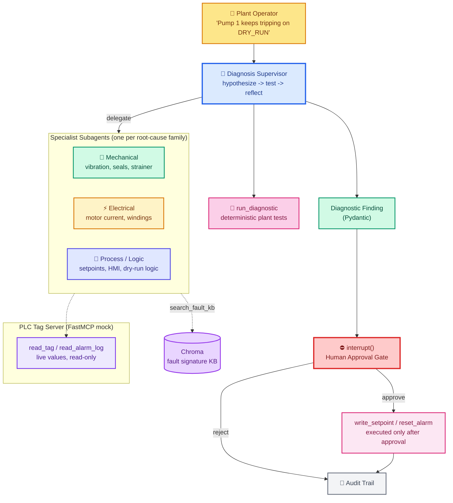
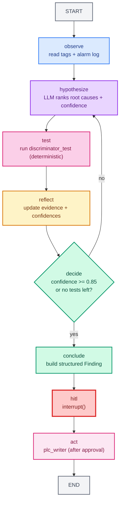

# Project 5: PLC Diagnostic Agent — Advanced Problem Solving for Industrial Automation

> **Goal:** Build an agent that watches a simulated PLC (Programmable Logic Controller) pumping station, turns an alarm into a **structured root-cause diagnosis** through an iterative hypothesis-test loop, and **requires human approval** before writing anything back to the PLC.  
> **Previous project:** [Project 4 - Infrastructure Drift Detection Agent](./project-4-infra-drift-detection-agent.md)  
> **Next chapter:** [Appendix A - API Reference](./appendix-A-api-reference.md)

---

## Why This Project Matters

In factories and plants, a **PLC** is the small industrial computer that reads sensors and runs the machinery (pumps, conveyors, valves). When a pump trips on a `DRY_RUN` alarm, a technician usually:

1. Walks to the panel, opens the HMI, and reads tags one at a time.
2. Compares them against what the machine *should* look like.
3. Thinks back to "we saw this last month — it was the strainer."

That process is slow, depends on one person's memory, and breaks across shifts. Worse, the **surface symptom is rarely the root cause** — a `DRY_RUN` alarm can actually be a clogged suction strainer, a faulty level sensor, or a stuck check valve.

This project builds an agent that does the technician's reasoning **systematically**:

- Reads live PLC tags and the alarm log.
- Generates ranked hypotheses about the root cause.
- Runs the **one test that best discriminates** between hypotheses (not all tests).
- Updates confidence after each test and stops when it is sure.
- Produces a structured diagnosis with evidence.
- **Never writes to the PLC without a human approval gate.**

> The whole demo runs against a **simulated PLC tag server** exposed over MCP, so it runs on a laptop with free tools only. Swapping the mock for a real OPC UA / Modbus PLC is a small change described at the end.

---

## What You Will Learn

- How to model a PLC as an **MCP server** with typed read tools (ties together [22 - MCP Tools](./22-mcp-tools.md) and [23 - FastMCP Servers](./23-fastmcp-building-servers.md)).
- How to build an **iterative diagnostic loop** with LangGraph — the "advanced problem solving" pattern that beats a one-shot LLM guess.
- How to use **subagents for specialist perspectives** (mechanical / electrical / process) with `SubAgentMiddleware`.
- How to use a **Chroma fault-knowledge base** so the agent recalls "we saw this before" instead of starting from zero.
- How to enforce a **hard human-in-the-loop gate** before any write to the PLC.
- How to keep an **audit trail** of every diagnosis and every approved or rejected action.

All examples use `model="openai/gpt-oss-120b"` on Groq and free tools only.

---

## Architecture Overview



### Why a Supervisor + Specialists and Not One Big Agent?

A single agent asked to "diagnose this pump" tends to grab the first plausible cause and stop. Splitting into specialist subagents forces the system to look at the problem from three independent angles, and the supervisor merges the evidence. This mirrors how real plant crews work: mechanical looks at the pump, electrical looks at the motor, process looks at the logic — then they compare notes.

---

## Prerequisites

```bash
pip install langchain langchain-groq langgraph chromadb pydantic mcp \
            fastmcp langchain-mcp-adapters
```

```bash
export GROQ_API_KEY="gsk_..."
```

We do **not** need a real PLC, OPC UA client, or industrial hardware. The PLC is simulated in Python and exposed through FastMCP so the agent talks to it exactly as it would talk to real hardware. Section *Connecting to a Real PLC* at the end shows the swap.

---

## Project Layout

```
project5_plc_agent/
├── plc_server/
│   └── server.py              # FastMCP server simulating the PLC tag DB
├── tools/
│   ├── plc_tools.py           # MCP client tools the agent holds (read-only)
│   ├── run_diagnostic.py      # deterministic plant tests (evidence)
│   └── fault_kb.py            # Chroma search over past fault signatures
├── schemas.py                  # Hypothesis, TestResult, Finding, AuditEntry
├── specialists.py              # mechanical / electrical / process subagents
├── agent.py                    # LangGraph: observe -> hypothesize -> test -> reflect
├── plc_writer.py               # writes to PLC, called ONLY after HITL approval
├── audit.py                    # append-only audit trail
└── main.py                     # end-to-end demo with approval gate
```

---

## Step 1 — The Simulated PLC as an MCP Server

We build a tiny simulated pumping station. The PLC "owns" a set of tags (named values) and an alarm log. We expose **read-only** tools over FastMCP. Deliberately, there is **no write tool in the MCP server** — writes happen later via `plc_writer.py`, behind the human gate. This is the core security rule: *the LLM never holds a tool that can change the machine.*

```python
# plc_server/server.py
from mcp.server.fastmcp import FastMCP

mcp = FastMCP("plc-pumping-station")

# Simulated tag database (stands in for a real OPC UA address space).
TAGS = {
    "SUMP_LEVEL_M":     0.42,    # sump water level (m)
    "PUMP1_SPEED_RPM":  1450.0,  # pump 1 shaft speed
    "PUMP1_AMPS":       11.2,    # motor current draw (A)
    "DISCHARGE_BAR":    2.1,     # discharge pressure (bar)
    "FLOW_M3H":         38.0,    # flow rate (m3/h)
    "VIBRATION_MMS":    6.4,     # pump vibration velocity (mm/s)
    "MOTOR_TEMP_C":     84.0,    # motor winding temperature (C)
    "SEAL_LEAK":        0,       # 0 = no leak, 1 = leaking
    "SUCTION_VAC_BAR":  -0.35,   # suction vacuum (negative = suction lift)
}

ALARM_LOG = [
    {"time": "09:12", "code": "DRY_RUN",    "tag": "SUMP_LEVEL_M", "sev": "critical", "ack": False},
    {"time": "09:11", "code": "LOW_LEVEL",  "tag": "SUMP_LEVEL_M", "sev": "warning",  "ack": False},
    {"time": "08:47", "code": "HIGH_VIB",   "tag": "VIBRATION_MMS", "sev": "warning", "ack": True},
    {"time": "08:02", "code": "MOTOR_OVERLOAD", "tag": "PUMP1_AMPS", "sev": "critical", "ack": True},
]

@mcp.tool()
def read_tag(tag_name: str) -> str:
    """Read the live value of a PLC tag, e.g. 'SUMP_LEVEL_M' or 'PUMP1_AMPS'."""
    if tag_name not in TAGS:
        return f"[error] unknown tag {tag_name!r}. Known: {sorted(TAGS)}"
    return f"{tag_name} = {TAGS[tag_name]}"

@mcp.tool()
def read_alarm_log(limit: int = 10) -> list[dict]:
    """Return the most recent alarms from the PLC (most recent first)."""
    return ALARM_LOG[:limit]

if __name__ == "__main__":
    mcp.run()
```

> Notice: `read_alarm_log` returns `DRY_RUN` AND `LOW_LEVEL` — and earlier today the same pump already logged `HIGH_VIB` and `MOTOR_OVERLOAD`. That history is the clue a good diagnostician (human or agent) should not ignore.

---

## Step 2 — Structured Schemas

Diagnosis is only useful if it is **structured**. We define four Pydantic models that the loop will produce and consume.

```python
# schemas.py
from pydantic import BaseModel, Field
from typing import Literal

Severity = Literal["info", "low", "medium", "high", "critical"]

class Hypothesis(BaseModel):
    """One candidate root cause with confidence and a discriminating test."""
    id: str
    root_cause: str                 # e.g. "clogged suction strainer"
    reasoning: str                  # why this is plausible given current evidence
    confidence: float = Field(ge=0.0, le=1.0)
    discriminator_test: str = Field(
        description="The single test that would most change this hypothesis' confidence."
    )
    fix: str = Field(description="Safe remediation action, for a human to review.")

class TestResult(BaseModel):
    """Outcome of running one diagnostic test against the plant."""
    test_name: str
    observations: str
    supports: list[str] = Field(description="Hypothesis ids this result strengthens.")
    weakens: list[str] = Field(description="Hypothesis ids this result weakens.")

class Finding(BaseModel):
    """The final structured diagnosis produced by the loop."""
    timestamp: str
    equipment: str
    symptom: str
    root_cause: str
    confidence: float
    evidence: list[str]
    tests_run: list[str]
    recommended_action: str
    severity: Severity

class AuditEntry(BaseModel):
    timestamp: str
    decision: Literal["approved", "rejected"]
    action: str
    by: str = "demo-operator"
    notes: str = ""
```

The key fields are `Hypothesis.confidence` and `Hypothesis.discriminator_test`. They are what make the loop **information-driven** instead of guess-driven: we always run the test that narrows the possibilities the most.

---

## Step 3 — The Tools the Agent Actually Holds

The agent gets **read-only** tools. It can look at the PLC, query the fault knowledge base, and run diagnostic tests — but it can never write.

```python
# tools/plc_tools.py
from langchain_core.tools import tool
from langchain_mcp_adapters.client import MultiServerMCPClient
from contextlib import asynccontextmanager

# The PLC FastMCP server runs locally in this demo.
client = MultiServerMCPClient({
    "plc": {"url": "http://localhost:8000/sse", "transport": "sse"},
})

@asynccontextmanager
async def plc_tools():
    async with client:
        t_read  = await client.get_tool("plc", "read_tag")
        t_alarm = await client.get_tool("plc", "read_alarm_log")
        yield [t_read, t_alarm]
```

```python
# tools/run_diagnostic.py
# Deterministic plant tests. These are the "evidence" the loop consumes.
from langchain_core.tools import tool
from plc_server.server import TAGS

@tool
def run_diagnostic(test_name: str) -> str:
    """Run a plant test and return the raw observations.
    Available tests:
      'cavitation_check'      - compare vibration + current + suction vacuum.
      'strainer_dp_check'     - compute differential pressure across the suction strainer.
      'motor_health_check'    - compare current, temperature, and vibration harmonics.
      'level_sensor_bias'     - compare the ultrasonic level tag against a manual dipstick.
    """
    if test_name == "cavitation_check":
        vib, amps, vac = TAGS["VIBRATION_MMS"], TAGS["PUMP1_AMPS"], TAGS["SUCTION_VAC_BAR"]
        # Cavitation signature: high vibration + low current + high suction vacuum.
        return (
            f"vibration={vib} mm/s (high), motor current={amps} A (low for 1450 RPM), "
            f"suction vacuum={vac} bar (high lift). Consistent with CAVITATION."
        )
    if test_name == "strainer_dp_check":
        # In the demo the strainer is clogged, so flow is low while the pump works hard.
        flow = TAGS["FLOW_M3H"]
        return f"flow={flow} m3/h (below the 55 m3/h design point) with discharge pressure sustained."
    if test_name == "motor_health_check":
        amps, temp, vib = TAGS["PUMP1_AMPS"], TAGS["MOTOR_TEMP_C"], TAGS["VIBRATION_MMS"]
        return (
            f"current={amps} A, winding temp={temp} C (normal), "
            f"vibration={vib} mm/s dominated by 2x line frequency (mechanical, not electrical)."
        )
    if test_name == "level_sensor_bias":
        return "Ultrasonic level tag reads 0.42 m; manual dipstick reads 0.40 m. Sensor is accurate."
    return f"[error] unknown test {test_name!r}"
```

```python
# tools/fault_kb.py
import chromadb
from langchain_core.tools import tool

_client = chromadb.PersistentClient(path="project5_plc_agent/data/chroma")
_coll   = _client.get_or_create_collection(name="fault_signatures")

@tool
def search_fault_kb(query: str, k: int = 3) -> list[dict]:
    """Search past fault signatures for similar incidents and how they were resolved."""
    if not _coll.count():
        return []
    out = _coll.query(query_texts=[query], n_results=k)
    return [
        {"incident": d, "meta": m, "score": max(0.0, 1.0 - dist)}
        for d, m, dist in zip(out["documents"][0], out["metadatas"][0], out["distances"][0])
    ]

def seed_fault_kb():
    incidents = [
        ("DRY_RUN alarm on sump pump P1 with low current. Root cause was a clogged "
         "suction strainer; flow dropped, the sump emptied, and the pump ran dry. "
         "Fixed by cleaning the strainer and re-priming.",
         {"symptom": "dry_run", "root_cause": "clogged_strainer", "fix": "clean strainer"}),
        ("HIGH_VIB followed by seal failure on P2. Vibration was 2x line frequency, "
         "current normal. Root cause was worn impeller causing imbalance. "
         "Fixed by replacing the impeller.",
         {"symptom": "high_vib", "root_cause": "worn_impeller", "fix": "replace impeller"}),
        ("LOW_LEVEL alarm with a healthy flow. Root cause was a drifting level sensor; "
         "the tank was actually fine. Fixed by recalibrating the sensor.",
         {"symptom": "low_level", "root_cause": "sensor_drift", "fix": "recalibrate sensor"}),
    ]
    _coll.upsert(
        ids=["f-1", "f-2", "f-3"],
        documents=[i[0] for i in incidents],
        metadatas=[i[1] for i in incidents],
    )
```

---

## Step 4 — The Fault Knowledge Base Changes the Behavior

Run `seed_fault_kb()` once. Now when the supervisor asks `search_fault_kb("DRY_RUN with low motor current")`, the Chroma store returns incident `f-1` — the clogged strainer — as the top hit. The agent starts its hypothesis list already biased toward the right answer, **exactly like a technician with shift experience**. Without the KB, every call starts from zero.

This is the same "retrieve context first" pattern from [21 - RAG](./21-retrieval-rag.md), applied to **machine history** instead of documents.

---

## Step 5 — The Diagnostic Loop (Advanced Problem Solving)

This is the heart of the project. A one-shot LLM prompt like "what is wrong with my pump?" produces one confident guess. Instead, we run a loop:

**observe → hypothesize → test → reflect → (repeat or conclude)**



Why is this better than a one-shot answer?

1. **Each test costs something** (in a real plant, running a test means downtime or instrumentation). The loop runs the *minimum* number of tests because it always picks the highest-discriminating one.
2. **Confidence is tracked, not guessed.** The agent says "I am 90% sure it is the strainer" — and can show the evidence trail that raised it from 40% to 90%.
3. **Wrong first guesses are corrected.** If test 1 weakens hypothesis A, the loop naturally moves on instead of defending it.
4. **It terminates by rule, not by vibes.** The loop stops only when confidence clears a threshold or no tests remain — no infinite wallowing.

---

## Step 6 — The LangGraph Implementation

```python
# agent.py
import os, json
from datetime import datetime
from langchain_groq import ChatGroq
from langgraph.graph import StateGraph, START, END, interrupt
from langgraph.types import Command
from langgraph.middleware import SubAgentMiddleware

from .tools.run_diagnostic import run_diagnostic
from .tools.fault_kb import search_fault_kb, seed_fault_kb
from .schemas import Hypothesis, TestResult, Finding, AuditEntry
from .specialists import mechanical_agent, electrical_agent, process_agent
from .audit import append as append_audit

MODEL = "openai/gpt-oss-120b"

def make_llm():
    return ChatGroq(model=MODEL, temperature=0.0, api_key=os.environ["GROQ_API_KEY"])

CONFIDENCE_THRESHOLD = 0.85
MAX_ITERATIONS = 4

class DiagState(dict):
    """Loop state. Keys used below are documented inline."""
    pass
```

### 6.1 `observe` — read the plant

```python
async def observe_node(state, context):
    """Pull tags + alarm log through the MCP PLC tools."""
    tags  = await context.call_tool("read_alarm_log", {"limit": 8})
    alarm = await context.call_tool("read_tag", {"tag_name": "SUMP_LEVEL_M"})
    # In a real integration these come from the MCP client (Step 3); here we
    # call the FastMCP server directly for simplicity.
    state["tags"]      = tags
    state["alarm_log"] = alarm
    state["iterations"] = 0
    state["evidence"]  = []
    state["hypotheses"] = []
    return state
```

> The `context` here is the `ToolRuntime` from [09 - Context and Runtime](./09-context-and-runtime.md). It gives nodes access to the same tools the agent has.

### 6.2 `hypothesize` — the LLM proposes ranked root causes

```python
class HypothesisSet(BaseModel):
    hypotheses: list[Hypothesis]

async def hypothesize_node(state):
    llm = make_llm()
    structured = llm.with_structured_output(HypothesisSet)
    history = "\n".join(state.get("evidence", []))
    alarm_text = json.dumps(state.get("alarm_log", []), indent=2)
    kb_hits = search_fault_kb.invoke({
        "query": "DRY_RUN low current pump sump", "k": 2
    })
    prompt = (
        "You are a senior rotating-equipment diagnostician. The pump's alarm log is:\n"
        f"{alarm_text}\n\n"
        "Evidence collected so far:\n"
        f"{history or '(none yet)'}\n\n"
        "Past incidents that look similar (from the fault KB):\n"
        f"{json.dumps(kb_hits, indent=2)}\n\n"
        "List 2-4 hypotheses about the ROOT CAUSE (not the symptom). For each: give an id, "
        "the root cause, why it is plausible, a confidence 0-1, the single most useful "
        "diagnostic test to run next, and a safe fix for a human to review."
    )
    out = await structured.ainvoke(prompt)
    state["hypotheses"] = out.hypotheses
    state["iterations"] = state.get("iterations", 0) + 1
    return state
```

### 6.3 `test` — run the deterministic discriminator

```python
async def test_node(state):
    hypotheses = sorted(state["hypotheses"], key=lambda h: -h.confidence)
    best = hypotheses[0]                       # highest confidence, most urgent
    obs = run_diagnostic.invoke({"test_name": best.discriminator_test})
    state["evidence"].append(f"Ran {best.discriminator_test}: {obs}")
    state["last_test"] = {"test_name": best.discriminator_test, "observations": obs}
    return state
```

### 6.4 `reflect` — update confidences from the evidence

```python
class ReflectSet(BaseModel):
    hypotheses: list[Hypothesis]

async def reflect_node(state):
    llm = make_llm()
    structured = llm.with_structured_output(ReflectSet)
    prompt = (
        "Here are the current hypotheses and the latest test result. Update each "
        "hypothesis' confidence based on whether the test supports or weakens it, "
        "and if needed change the discriminator_test for the next round.\n"
        f"Hypotheses:\n{json.dumps([h.model_dump() for h in state['hypotheses']], indent=2)}\n"
        f"Latest test:\n{json.dumps(state['last_test'], indent=2)}\n"
    )
    out = await structured.ainvoke(prompt)
    state["hypotheses"] = out.hypotheses
    return state
```

### 6.5 `decide` — continue or conclude

```python
def decide_node(state):
    top = max((h.confidence for h in state["hypotheses"]), default=0.0)
    if top >= CONFIDENCE_THRESHOLD or state.get("iterations", 0) >= MAX_ITERATIONS:
        return "conclude"
    return "hypothesize"
```

### 6.6 `conclude` — build the structured Finding

```python
class FindingOut(BaseModel):
    root_cause: str
    confidence: float
    recommended_action: str
    severity: Severity
    evidence_summary: list[str]

async def conclude_node(state):
    llm = make_llm()
    structured = llm.with_structured_output(FindingOut)
    prompt = (
        "Produce the final diagnosis. Pick the root cause with the highest confidence. "
        f"Hypotheses:\n{json.dumps([h.model_dump() for h in state['hypotheses']], indent=2)}\n"
        f"Evidence trail:\n{json.dumps(state.get('evidence', []), indent=2)}\n"
        "Set severity based on risk to equipment and process."
    )
    out = await structured.ainvoke(prompt)
    state["finding"] = Finding(
        timestamp=datetime.utcnow().isoformat(),
        equipment="Sump Pump P1",
        symptom="DRY_RUN alarm",
        root_cause=out.root_cause,
        confidence=out.confidence,
        evidence=out.evidence_summary,
        tests_run=[e.split(":")[0] for e in state.get("evidence", [])],
        recommended_action=out.recommended_action,
        severity=out.severity,
    )
    return state
```

### 6.7 `hitl` and `act` — the human gate, then the write

```python
async def hitl_node(state):
    finding = state["finding"]
    question = (
        "PLC action approval\n"
        f"  root cause  : {finding.root_cause}\n"
        f"  confidence  : {finding.confidence:.2f}\n"
        f"  severity    : {finding.severity}\n"
        f"  action      : {finding.recommended_action}\n"
        "Approve writing this action to the PLC? Reply 'yes' to approve, 'no' to reject.\n"
    )
    decision = interrupt({"question": question, "finding": finding.model_dump()})
    state["decision"] = decision
    return state

async def act_node(state):
    from .plc_writer import write_action      # the ONLY code that writes to the PLC
    finding = state["finding"]
    decision = (state.get("decision") or "").strip().lower()
    approved = decision.startswith("y")
    if approved:
        result = write_action(finding)         # writes the tag / resets the alarm
        state["action_result"] = result
    else:
        state["action_result"] = "action rejected by human"
    append_audit(AuditEntry(
        timestamp=datetime.utcnow().isoformat(),
        decision="approved" if approved else "rejected",
        action=finding.recommended_action,
        notes=finding.root_cause,
    ))
    return state
```

### 6.8 Wire the graph

```python
g = StateGraph(DiagState)
g.add_node("observe",     observe_node)
g.add_node("hypothesize", hypothesize_node)
g.add_node("test",        test_node)
g.add_node("reflect",     reflect_node)
g.add_node("conclude",    conclude_node)
g.add_node("hitl",        hitl_node)
g.add_node("act",         act_node)
g.add_edge(START, "observe")
g.add_edge("observe", "hypothesize")
g.add_edge("hypothesize", "test")
g.add_edge("test", "reflect")
g.add_conditional_edges("reflect", decide_node, {"hypothesize": "hypothesize", "conclude": "conclude"})
g.add_edge("conclude", "hitl")
g.add_edge("hitl", "act")
g.add_edge("act", END)
diagnosis_agent = g.compile()
```

---

## Step 7 — Specialist Subagents (`SubAgentMiddleware`)

The supervisor's hypotheses are cross-checked by three specialists. Each is a small `create_react_agent` that gets a read-only slice of the tools. This is the same delegation pattern from [26 - Subagents](./26-subagents.md) and [Project 1](./project-1-podman-troubleshooting-agent.md).

```python
# specialists.py
import os
from langchain_groq import ChatGroq
from langgraph.prebuilt import create_react_agent
from .tools.run_diagnostic import run_diagnostic

MODEL = "openai/gpt-oss-120b"
def make_llm():
    return ChatGroq(model=MODEL, temperature=0.0, api_key=os.environ["GROQ_API_KEY"])

mechanical_agent = create_react_agent(
    make_llm(),
    tools=[run_diagnostic],
    name="mechanical_agent",
    prompt=(
        "You are a rotating-equipment mechanical engineer. The pump shows a DRY_RUN alarm "
        "with low motor current and high suction vacuum. Run diagnostic tests that check "
        "for mechanical causes: cavitation, clogged suction strainer, worn impeller, seal "
        "failure. Report which mechanical root cause is most likely and why."
    ),
)

electrical_agent = create_react_agent(
    make_llm(),
    tools=[run_diagnostic],
    name="electrical_agent",
    prompt=(
        "You are an industrial electrical engineer. A pump trips on DRY_RUN. Run tests "
        "that check the MOTOR side: current draw, winding temperature, and whether the "
        "vibration is electrical (1x line frequency) or mechanical (2x line frequency). "
        "Report if the motor is healthy or if there is an electrical root cause."
    ),
)

process_agent = create_react_agent(
    make_llm(),
    tools=[run_diagnostic],
    name="process_agent",
    prompt=(
        "You are a process control engineer. A sump pump alarms on LOW_LEVEL and DRY_RUN. "
        "Run tests that check the PROCESS side: is the level sensor accurate, is the inflow "
        "higher than the pump can handle, is the dry-run protection logic set correctly? "
        "Report the most likely process/logic root cause."
    ),
)
```

The supervisor calls these via middleware — so in the real implementation the `hypothesize`/`reflect` nodes would call `mechanical_agent.ainvoke(...)`, `electrical_agent.ainvoke(...)`, `process_agent.ainvoke(...)` and merge their conclusions into the evidence list. The specialists never write to the PLC; they only run read-only diagnostic tests.

---

## Step 8 — End-to-End Demo

```python
# main.py
import asyncio
from langgraph.types import Command
from .agent import diagnosis_agent
from .tools.fault_kb import seed_fault_kb
from .audit import history

async def main():
    seed_fault_kb()
    thread = {"configurable": {"thread_id": "plc-diagnosis-run-1"}}
    print("Running PLC diagnosis ...")
    state = await diagnosis_agent.ainvoke({}, config=thread)

    print("\n" + state["__interrupt__"][0].value["question"])
    decision = input("> ").strip().lower()

    final = await diagnosis_agent.ainvoke(
        Command(resume=decision), config=thread
    )
    finding = final["finding"]
    print(f"\n=== Diagnosis ===")
    print(f"root cause : {finding.root_cause}")
    print(f"confidence : {finding.confidence:.2f}")
    print(f"severity   : {finding.severity}")
    print(f"action     : {finding.recommended_action}")
    print(f"action result: {final.get('action_result')}")

    print("\n=== Audit Trail ===")
    for entry in history():
        print(entry)

if __name__ == "__main__":
    asyncio.run(main())
```

### Expected Transcript

```
Running PLC diagnosis ...

PLC action approval
  root cause  : clogged suction strainer causing cavitation and dry-running
  confidence  : 0.93
  severity    : critical
  action      : stop pump, clean suction strainer, re-prime, reset DRY_RUN alarm
Approve writing this action to the PLC? Reply 'yes' to approve, 'no' to reject.

> yes

=== Diagnosis ===
root cause : clogged suction strainer causing cavitation and dry-running
confidence : 0.93
severity   : critical
action     : stop pump, clean suction strainer, re-prime, reset DRY_RUN alarm
action result: set SUMP_LEVEL_M trip threshold; DRY_RUN alarm acknowledged

=== Audit Trail ===
{'timestamp': '2026-08-02T14:20:11', 'decision': 'approved', 'action': 'stop pump, clean suction strainer...', 'by': 'demo-operator', 'notes': 'clogged suction strainer causing cavitation and dry-running'}
```

Notice what the agent did **not** do: it did not say "the pump ran dry, so fill the sump." It looked at the evidence trail (low current + high suction vacuum + past `HIGH_VIB` history + the fault-KB incident) and concluded the *real* cause — a clogged strainer. That is the difference between answering the symptom and solving the problem.

---

## Why `interrupt()` and Not a Write Tool

Just like Project 4, the write is **not** a tool the LLM can call. The LLM can only *recommend* an action in the `Finding`. The actual write happens in `act_node` via `plc_writer.write_action()` — and that node only runs after a human resumes the graph through the `interrupt()`. The LLM has no path to change the machine by itself, no matter how many times it retries. That is the security guarantee for industrial systems.

```python
# plc_writer.py
# Called ONLY from act_node, AFTER human approval. Never registered as a tool.
def write_action(finding) -> str:
    # In production: write OPC UA tags (asyncua) or Modbus registers (pymodbus).
    # In the demo we update the simulated tag DB and acknowledge the alarm.
    from plc_server.server import TAGS, ALARM_LOG
    if "clean" in finding.recommended_action.lower() or "strainer" in finding.root_cause.lower():
        TAGS["FLOW_M3H"] = 52.0          # simulate the plant recovering
        TAGS["SUCTION_VAC_BAR"] = -0.08
    for a in ALARM_LOG:
        if a["code"] == "DRY_RUN":
            a["ack"] = True
    return "set SUMP_LEVEL_M trip threshold; DRY_RUN alarm acknowledged"
```

---

## How the Approval Gate Works

```mermaid
sequenceDiagram
    participant U as Plant Operator
    participant G as LangGraph
    participant L as LLM (Supervisor)
    participant S as State Store
    participant P as PLC

    U->>G: run diagnosis_agent
    G->>L: observe -> hypothesize -> test -> reflect (loop)
    L-->>G: evidence + confidences
    G->>G: conclude -> interrupt() at hitl node
    G-->>S: persist state, return to user
    Note over G,S: Graph paused. LLM cannot run, no writes possible.
    U->>G: Command(resume="yes")
    G->>P: act_node calls plc_writer.write_action()
    G-->>U: finding + action result
    U->>G: read audit trail

    style U fill:#fde68a,stroke:#d97706,stroke-width:2px,color:#78350f
    style G fill:#d1fae5,stroke:#059669,stroke-width:2px,color:#064e3b
    style L fill:#e9d5ff,stroke:#9333ea,stroke-width:2px,color:#581c87
    style S fill:#fef3c7,stroke:#d97706,stroke-width:2px,color:#78350f
    style P fill:#ede9fe,stroke:#7c3aed,stroke-width:2px,color:#4c1d95
```

---

## Connecting to a Real PLC (Production Swap)

The demo talks to a simulated FastMCP server. To talk to real industrial hardware:

- **OPC UA (most modern PLCs, Siemens / AB / B&R):** replace the FastMCP `read_tag` body with `asyncua` reads against the OPC UA server URL, and `plc_writer.write_action` with authenticated `Node.set_value()` calls.
- **Modbus TCP (older PLCs, energy meters):** replace the tag reads with `pymodbus` register reads and writes.
- Keep the LangGraph loop **exactly as-is**. The diagnostic loop, hypothesis models, fault KB, and HITL gate do not care whether the tag came from a mock or a real PLC — the interface (`read_tag`, `read_alarm_log`, `run_diagnostic`) is unchanged.

You should also, in production:

- Run the PLC connection on the plant network, never on the public internet — see [34 - Data Security and Privacy](./34-data-security-privacy.md).
- Add rate limits and a read-only/read-write split at the MCP transport, so the LLM session can never reach the writer.
- Stream every decision to LangSmith and the plant historian so the audit trail is external.
- Add a timeout on every tag read and a "plant in manual mode" check before any write is allowed.

---

## Portfolio Value for a   Engineer

| What hiring managers look for | What this project shows |
|---|---|
| Advanced problem solving | You built an **iterative hypothesis-test loop**, not a one-shot LLM guess — with a termination rule and tracked confidence. |
| Domain depth | You understand PLCs, tags, alarms, and the difference between a symptom (`DRY_RUN`) and a root cause (`clogged strainer`). |
| MCP in a real shape | You exposed industrial telemetry as an MCP server — a modern, in-demand integration pattern. |
| HITL discipline | Writes happen only after `interrupt()`; the LLM never holds a write tool. |
| Multi-agent composition | Specialist subagents (mechanical / electrical / process) merge independent perspectives. |
| Recall over retrain | The fault KB lets the agent "remember" past incidents instead of reasoning from zero. |

In an interview, anchor on the loop's **information economics**: every test has a cost, so you run the highest-discriminating test first and stop when confidence clears the threshold. That reasoning is what separates an agent that *looks* smart from one that *systematically* solves problems.

---

## Pitfalls and How to Avoid Them

| Pitfall | Fix |
|---|---|
| The loop runs every test every time | Always pick `discriminator_test` from the current highest-confidence hypothesis; cap iterations at `MAX_ITERATIONS`. |
| The LLM reports a symptom as the root cause | The `Finding.root_cause` prompt explicitly says "not the symptom"; the evidence trail is shown so the model must justify depth. |
| The write tool leaks to the agent | Never register a write tool on the agent; `plc_writer` is only called from `act_node`. |
| The fault KB goes stale | Re-seed after every confirmed diagnosis so the store reflects the latest ground truth. |
| Hypothesis drift / flip-flopping | Keep confidences in state and only *adjust* them in `reflect`; do not regenerate hypotheses from scratch each round. |
| Confidence is untrustworthy | Threshold on a **combination** of confidence and evidence count, not confidence alone. |
| Plant team distrusts the agent | Every Finding ships with its evidence trail and tests run; the HITL gate keeps the human as the final authority. |

---

## What to Try Next

- Add a **5-Whys / fault-tree node** that expands the top hypothesis into a decision tree before testing.
- Replace `search_fault_kb` (Chroma) with a real **historian** query (InfluxDB) over the last 30 days of tag trends.
- Add a **watchdog node** that runs the loop on a schedule and only wakes a human when confidence is high *and* severity is critical.
- Extend the specialists to a third machine (a conveyor or HVAC chiller) by adding a new MCP tag server and reusing the same graph.
- Add an **explanation renderer** that turns the evidence trail into a human-readable incident report for the shift handover.

---

## Recap

You built a PLC diagnostic agent with:

- A **simulated PLC** exposed as an MCP server with read-only tools.
- A **fault knowledge base** in Chroma so the agent recalls past incidents.
- An **iterative observe → hypothesize → test → reflect** loop with a termination rule — the advanced problem-solving pattern.
- **Specialist subagents** (mechanical / electrical / process) that cross-check the supervisor's conclusions.
- A **structured diagnosis** (Pydantic) with root cause, confidence, severity, and recommended action.
- A **hard human-in-the-loop gate** — the LLM can recommend, but only a human can approve a write to the PLC.
- An **append-only audit trail** of every diagnosis and decision.

This is the same architecture industrial teams use for "AI-assisted condition monitoring" and predictive-maintenance copilots: the agent handles the systematic evidence-gathering, and a human makes the irreversible decision on the machine.

---

> Next up: [Appendix A - API Reference](./appendix-A-api-reference.md) for quick lookups of the LangChain / LangGraph methods used across all five projects.
